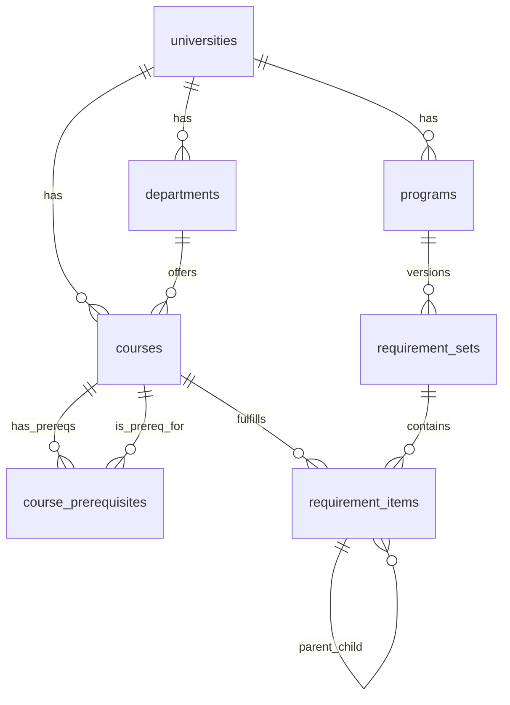

# Sprint 1: Foundation and Data Layer

## Enhancement Summary

**Deepened on:** 2026-04-01
**Sections enhanced:** 6
**Research agents used:** framework-docs-researcher (Supabase), best-practices-researcher (UUID/pipelines), data-integrity-guardian (migration review), Context7 (Supabase JS, Zod v3)

### Key Improvements from Deepening

1. **UUID v5 namespace fix** — use a custom app namespace, not the DNS namespace
2. **Supabase upsert composite key syntax** — `onConflict: 'col1,col2'` (comma-separated string)
3. **Generated tsvector column** — more efficient than inline `to_tsvector()` in index expression
4. **Missing `updated_at` trigger** — add Postgres function for auto-updating timestamps
5. **Course code generated column** — needs a space separator: `subject_code || ' ' || number`
6. **Vitest config** — each package needs a minimal `vitest.config.ts` even with root `test.projects`

### Research Insights by Section

<details>
<summary>UUID v5 Strategy (Section 2.4)</summary>

**Fix:** The plan uses `6ba7b810-9dad-11d1-80b4-00c04fd430c8` which is the well-known DNS namespace UUID from RFC 4122. This is meant for generating UUIDs from domain names, not application IDs. Generate a custom namespace UUID once:

```typescript
import { v4 as uuidv4, v5 as uuidv5 } from "uuid";

// Generate once, hardcode forever:
// const MAJORMAP_NS = uuidv4(); // run once → paste result below
const MAJORMAP_NS = "a1b2c3d4-e5f6-4a7b-8c9d-0e1f2a3b4c5d"; // example — generate your own

function courseUuid(universitySlug: string, subjectCode: string, number: string): string {
  return uuidv5(`course:${universitySlug}:${subjectCode}:${number}`, MAJORMAP_NS);
}
```

Adding a `course:` prefix prevents collisions between entity types sharing the same namespace.

</details>

<details>
<summary>Supabase Batch Upsert (Section 3.3)</summary>

**Pattern:** For composite unique constraints, pass column names as a comma-separated string:

```typescript
const { error } = await supabase
  .from("courses")
  .upsert(courseBatch, { onConflict: "university_id,subject_code,number" });
```

**Limits:** Supabase uses PostgREST which has a default max request body of ~2MB. With large `raw_data` JSONB columns, 500 rows may exceed this. **Recommendation:** Start with batches of 100 and increase if stable. Log batch sizes.

**`ignoreDuplicates` vs update:** The default upsert behavior updates on conflict. To skip existing rows without updating, pass `{ onConflict: '...', ignoreDuplicates: true }`. For the seed script, we WANT updates (to refresh data), so use the default.

</details>

<details>
<summary>Migration Improvements (Section 2.3)</summary>

**1. Course code generated column needs a space:**

```sql
-- WRONG: code text generated always as (subject_code || number) stored
-- Produces "CS3500" instead of "CS 3500"
-- RIGHT:
code text generated always as (subject_code || ' ' || number) stored
```

**2. Add `updated_at` trigger function:**

```sql
create or replace function update_updated_at()
returns trigger as $$
begin
  new.updated_at = now();
  return new;
end;
$$ language plpgsql;

create trigger courses_updated_at before update on courses
  for each row execute function update_updated_at();
create trigger programs_updated_at before update on programs
  for each row execute function update_updated_at();
```

**3. Use a stored `search_vector` column instead of inline tsvector:**

```sql
-- Add to courses table:
search_vector tsvector generated always as (
  to_tsvector('english', coalesce(title, '') || ' ' || coalesce(description, ''))
) stored;

-- Replace inline index with:
create index idx_courses_search on courses using gin(search_vector);
```

This avoids recomputing the tsvector on every query.

**4. Self-referential CASCADE on `requirement_items`:** Postgres handles recursive CASCADE correctly — deleting a parent node cascades to all descendants. No special handling needed.

**5. Missing composite unique constraint for prerequisite upserts:**

```sql
-- Add to course_prerequisites:
unique(course_id, prerequisite_course_id, group_id)
```

This enables the upsert `onConflict: 'course_id,prerequisite_course_id,group_id'`.

</details>

<details>
<summary>Zod Recursive Schema Pattern (Section 2.2)</summary>

The `CoursedogCourseSchema` uses `.passthrough()` correctly — this allows extra fields from the API without failing validation while still enforcing the fields we care about.

For the prerequisite rule tree (used in normalizers), the Zod v3 pattern for recursive types:

```typescript
interface PrerequisiteRule {
  id: string;
  condition: string;
  courseGroupIds?: string[];
  grade?: string;
  subRules?: PrerequisiteRule[];
}

const PrerequisiteRuleSchema: z.ZodType<PrerequisiteRule> = z.object({
  id: z.string(),
  condition: z.string(),
  courseGroupIds: z.array(z.string()).optional(),
  grade: z.string().optional(),
  subRules: z.lazy(() => z.array(PrerequisiteRuleSchema)).optional(),
});
```

**Note:** `z.lazy()` requires an explicit TypeScript type annotation (`z.ZodType<PrerequisiteRule>`) because TS cannot infer recursive types.

</details>

<details>
<summary>Vitest Projects Config (Section 1.3)</summary>

The root `vitest.config.ts` with `test.projects: ["packages/*"]` works IF each package has its own `vitest.config.ts`. Without per-package configs, Vitest won't know where to find tests or what environment to use.

**Minimal per-package config:**

```typescript
// packages/catalog/vitest.config.ts
import { defineConfig } from "vitest/config";
export default defineConfig({
  test: { name: "catalog", include: ["src/**/*.test.ts"] },
});
```

**Alternative:** Use inline project definitions in the root config to avoid per-package files:

```typescript
export default defineConfig({
  test: {
    projects: [
      { test: { name: "shared", root: "./packages/shared", include: ["src/**/*.test.ts"] } },
      { test: { name: "catalog", root: "./packages/catalog", include: ["src/**/*.test.ts"] } },
    ],
  },
});
```

The inline approach is simpler for a small monorepo. Use this.

</details>

<details>
<summary>ESLint Flat Config (Section 1.2)</summary>

A single root `eslint.config.mjs` works for all packages. The `ignores` pattern applies globally. One gotcha: TypeScript rules need `parserOptions.project` to point to each package's tsconfig for type-aware rules. For Sprint 1, skip type-aware rules (they're slow) and use only syntax-level checks.

</details>

---

## Overview

Transform the MajorMap monorepo from a stub scaffold into a professionalized codebase with a working data pipeline that seeds a Supabase database with real University of Utah catalog data. At the end of this sprint, a developer can run `pnpm catalog:seed` and have a queryable database of ~18,570 courses and ~593 programs.

## Review Feedback Applied

- **Eliminated `packages/supabase`** — Supabase client inlined in catalog package (only consumer)
- **Deferred user/plan/evaluation tables** — Only 7 catalog tables in Sprint 1, not 12
- **Dropped App Domain middle schema layer** — Two schemas: Coursedog Raw + Supabase DB types
- **Merged normalize into seed** — Two CLI commands (`fetch`, `seed`), not three
- **Dropped `commander`** — Simple `process.argv` routing for 2 commands
- **Single root ESLint config** — Not 5 per-package configs
- **One migration file** — Not 3 (fresh project)
- **Fixed UUID strategy** — Deterministic UUIDs via `uuid v5` from natural keys
- **Added schema refinements** — `creditsMin <= creditsMax`, `.min(1)` on strings, enum for degreeType
- **Added ON DELETE CASCADE** for catalog FKs
- **Two-pass normalize** explicitly documented
- **Deferred plan/user/evaluation schemas** to their respective sprints
- **Upgraded Vitest** to 3.2+ (was pinned at 1.6.0)
- **Added `zod` to catalog dependencies**

---

## Technical Approach

### Phase 1: Repo Professionalization

#### 1.1 Shared TypeScript Base Config

Create `tsconfig.base.json` at root (compiler options only):

```json
{
  "compilerOptions": {
    "target": "ES2020",
    "module": "ESNext",
    "moduleResolution": "Bundler",
    "strict": true,
    "esModuleInterop": true,
    "skipLibCheck": true,
    "forceConsistentCasingInFileNames": true,
    "resolveJsonModule": true,
    "isolatedModules": true,
    "declaration": true,
    "declarationMap": true,
    "sourceMap": true
  }
}
```

Create `tsconfig.json` at root for IDE project references:

```json
{
  "files": [],
  "references": [
    { "path": "apps/web" },
    { "path": "packages/catalog" },
    { "path": "packages/planner" },
    { "path": "packages/shared" }
  ]
}
```

Update each package tsconfig to `"extends": "../../tsconfig.base.json"`. Leave `packages/planner` untouched (stub, no Sprint 1 work).

**Files:** `tsconfig.base.json` (new), `tsconfig.json` (edit), `packages/shared/tsconfig.json`, `packages/catalog/tsconfig.json`, `apps/web/tsconfig.json`

#### 1.2 Single Root ESLint Config

One config at root covering all TypeScript packages:

```javascript
// eslint.config.mjs
import eslint from "@eslint/js";
import { defineConfig } from "eslint/config";
import tseslint from "typescript-eslint";

export default defineConfig([
  eslint.configs.recommended,
  ...tseslint.configs.recommended,
  { ignores: ["**/dist/", "**/.next/", "**/node_modules/"] },
]);
```

Next.js-specific ESLint deferred to Sprint 2 (when web app gets real code).

**Dependencies:** `eslint`, `@eslint/js`, `typescript-eslint` (root devDeps)

#### 1.3 Prettier + Vitest + CI + Housekeeping

```json
// .prettierrc
{ "semi": true, "singleQuote": false, "trailingComma": "all", "printWidth": 100 }
```

```typescript
// vitest.config.ts — Vitest 3.2+ (upgrade from 1.6.0)
import { defineConfig } from "vitest/config";
export default defineConfig({ test: { projects: ["packages/*"] } });
```

```yaml
# .github/workflows/ci.yml
name: CI
on: [push, pull_request]
jobs:
  check:
    runs-on: ubuntu-latest
    steps:
      - uses: actions/checkout@v4
      - uses: pnpm/action-setup@v4
      - uses: actions/setup-node@v4
        with: { node-version: 20, cache: pnpm }
      - run: pnpm install --frozen-lockfile
      - run: pnpm -r build
      - run: pnpm -r lint
      - run: pnpm -r test
      - run: pnpm format --check
```

- Add `.nvmrc` with `20`
- Add `"engines": { "node": ">=20" }` to root `package.json`
- Remove committed `dist/` artifacts
- Create `data/raw/fixtures/` directory
- Expand README (description, prereqs, setup, architecture, MIT license)
- Upgrade Vitest to `^3.2.0` across all packages

**Files:** `.prettierrc`, `.nvmrc`, `.github/workflows/ci.yml`, `vitest.config.ts`, `eslint.config.mjs` (all new), `README.md`, `package.json` (edit)

---

### Phase 2: Coursedog Raw Schemas + Supabase Migration

#### 2.1 Two-Schema Architecture (not three)

| Layer             | Purpose                    | Location                                    |
| ----------------- | -------------------------- | ------------------------------------------- |
| **Coursedog Raw** | Validate API responses     | `packages/catalog/src/schemas/coursedog.ts` |
| **Supabase DB**   | Auto-generated from schema | `packages/catalog/src/types/database.ts`    |

No intermediate "App Domain" layer. The seed step normalizes directly from Coursedog Raw → Supabase insert shapes. The auto-generated Supabase types serve as the canonical types for all downstream consumers.

**Rationale:** Data flows in one direction with one consumer. When the web app needs shared types (Sprint 2), extract them then — with a real consumer to inform the design.

#### 2.2 Coursedog Raw Schemas

```typescript
// packages/catalog/src/schemas/coursedog.ts
import { z } from "zod";

export const CoursedogCourseSchema = z
  .object({
    _id: z.string().min(1),
    code: z.string().min(1),
    subjectCode: z.string().min(1),
    courseNumber: z.string().min(1),
    name: z.string().min(1),
    longName: z.string().optional(),
    description: z.string().default(""),
    credits: z.object({
      numberOfCredits: z.number(),
      creditHours: z.object({ min: z.number(), max: z.number() }),
      repeatable: z.boolean(),
    }),
    departments: z.array(z.string()),
    college: z.string().default(""),
    career: z.string().default(""),
    institutionId: z.string(),
    courseGroupId: z.string(),
    requisites: z.record(z.unknown()).default({}),
  })
  .passthrough(); // Allow extra fields from API

export const CoursedogProgramSchema = z
  .object({
    _id: z.string().min(1),
    code: z.string().min(1),
    catalogDisplayName: z.string().min(1),
    catalogDescription: z.string().default(""),
    college: z.string().default(""),
    departments: z.array(z.string()).default([]),
    level: z.string().default(""),
    type: z.string().default(""),
    programLengthValue: z.number().nullable().default(null),
    requisites: z.record(z.unknown()).default({}),
    degreeMaps: z.array(z.unknown()).default([]),
  })
  .passthrough();
```

Validate during fetch (before writing to disk) — fail fast on API schema drift.

#### 2.3 Single Migration File (7 catalog tables)

**Deferred to their respective sprints:** `users`, `semester_plans`, `plan_semesters`, `plan_courses`, `evaluations`

```sql
-- supabase/migrations/20260401000001_catalog_schema.sql

-- 1. Universities
create table public.universities (
  id uuid primary key default gen_random_uuid(),
  slug text unique not null,
  name text not null,
  coursedog_school_id text,
  catalog_url text,
  created_at timestamptz not null default now()
);

-- 2. Departments
create table public.departments (
  id uuid primary key default gen_random_uuid(),
  university_id uuid not null references universities(id) on delete cascade,
  code text not null,
  name text not null,
  unique(university_id, code)
);

-- 3. Courses
create table public.courses (
  id uuid primary key,  -- deterministic UUID v5 from natural key
  university_id uuid not null references universities(id) on delete cascade,
  department_id uuid references departments(id) on delete set null,
  subject_code text not null,
  number text not null,
  code text generated always as (subject_code || ' ' || number) stored,
  title text not null,
  description text not null default '',
  credits_min numeric(3,1) not null,
  credits_max numeric(3,1) not null,
  typically_offered text[] not null default '{}',
  coursedog_id text,           -- original Coursedog _id for cross-reference
  course_group_id text,        -- Coursedog courseGroupId for prereq resolution
  raw_data jsonb,              -- full Coursedog response
  updated_at timestamptz not null default now(),
  unique(university_id, subject_code, number),
  check (credits_min <= credits_max)
);

-- 4. Course Prerequisites (structured, queryable)
create table public.course_prerequisites (
  id uuid primary key default gen_random_uuid(),
  course_id uuid not null references courses(id) on delete cascade,
  prerequisite_course_id uuid references courses(id) on delete cascade,
  group_id text not null,             -- groups rules into AND/OR sets
  group_operator text not null default 'AND',  -- 'AND' or 'OR'
  condition text not null,            -- 'minimumGrade', 'completedAnyOf', etc.
  min_grade text,
  is_corequisite boolean not null default false,
  description_override text,          -- freetext fallback for unparseable prereqs
  raw_rule jsonb,                     -- original Coursedog rule object
  unique(course_id, prerequisite_course_id, group_id)
);

-- 5. Programs
create table public.programs (
  id uuid primary key,  -- deterministic UUID v5
  university_id uuid not null references universities(id) on delete cascade,
  slug text not null,
  name text not null,
  degree_type text not null,           -- 'BS', 'BA', 'Minor', 'Certificate', etc.
  description text not null default '',
  total_credits integer,
  source_url text,
  raw_data jsonb,
  updated_at timestamptz not null default now(),
  unique(university_id, slug)
);

-- 6. Requirement Sets (versioned snapshots)
create table public.requirement_sets (
  id uuid primary key default gen_random_uuid(),
  program_id uuid not null references programs(id) on delete cascade,
  version_label text not null,         -- '2026-2027'
  captured_at timestamptz not null default now(),
  source_urls text[] not null default '{}',
  is_active boolean not null default true,
  unique(program_id, version_label)
);

-- 7. Requirement Items (tree via parent_id)
create table public.requirement_items (
  id uuid primary key default gen_random_uuid(),
  requirement_set_id uuid not null references requirement_sets(id) on delete cascade,
  parent_id uuid references requirement_items(id) on delete cascade,
  sort_order integer not null default 0,
  label text not null,
  type text not null,                  -- 'group', 'course', 'elective_slot', 'freetext'
  course_id uuid references courses(id) on delete set null,
  credits_required numeric,
  courses_required integer,
  description text,
  raw_rule jsonb                       -- original Coursedog rule for this item
);

-- Enable RLS on all tables
alter table public.universities enable row level security;
alter table public.departments enable row level security;
alter table public.courses enable row level security;
alter table public.course_prerequisites enable row level security;
alter table public.programs enable row level security;
alter table public.requirement_sets enable row level security;
alter table public.requirement_items enable row level security;

-- Public read policies (anon + authenticated)
create policy "anon select universities" on public.universities for select to anon using (true);
create policy "auth select universities" on public.universities for select to authenticated using (true);
create policy "anon select departments" on public.departments for select to anon using (true);
create policy "auth select departments" on public.departments for select to authenticated using (true);
create policy "anon select courses" on public.courses for select to anon using (true);
create policy "auth select courses" on public.courses for select to authenticated using (true);
create policy "anon select prereqs" on public.course_prerequisites for select to anon using (true);
create policy "auth select prereqs" on public.course_prerequisites for select to authenticated using (true);
create policy "anon select programs" on public.programs for select to anon using (true);
create policy "auth select programs" on public.programs for select to authenticated using (true);
create policy "anon select req_sets" on public.requirement_sets for select to anon using (true);
create policy "auth select req_sets" on public.requirement_sets for select to authenticated using (true);
create policy "anon select req_items" on public.requirement_items for select to anon using (true);
create policy "auth select req_items" on public.requirement_items for select to authenticated using (true);

-- Indexes
create index idx_courses_lookup on courses(university_id, subject_code, number);
-- Full-text search (using stored generated tsvector column — add to courses table)
-- ALTER TABLE courses ADD COLUMN search_vector tsvector
--   GENERATED ALWAYS AS (to_tsvector('english', coalesce(title,'') || ' ' || coalesce(description,''))) STORED;
create index idx_courses_search on courses using gin(search_vector);
create index idx_courses_group_id on courses(course_group_id);
create index idx_prereqs_course on course_prerequisites(course_id);
create index idx_prereqs_prereq on course_prerequisites(prerequisite_course_id);
create index idx_programs_browse on programs(university_id, degree_type);
create index idx_req_items_tree on requirement_items(requirement_set_id, parent_id, sort_order);
```

**Migration location:** `supabase/migrations/` at repo root (where Supabase CLI expects it), NOT inside a package.

#### 2.4 UUID Strategy

Use **UUID v5** with a fixed namespace for deterministic, idempotent IDs:

```typescript
import { v5 as uuidv5 } from "uuid";
// Custom app namespace (NOT the DNS namespace — generate once via uuidv4, hardcode forever)
const MAJORMAP_NS = "f47ac10b-58cc-4372-a567-0e02b2c3d479";

// Courses: keyed on university slug + subject + number
function courseUuid(universitySlug: string, subjectCode: string, number: string): string {
  return uuidv5(`${universitySlug}:${subjectCode}:${number}`, MAJORMAP_NS);
}

// Programs: keyed on university slug + program slug
function programUuid(universitySlug: string, programSlug: string): string {
  return uuidv5(`${universitySlug}:${programSlug}`, MAJORMAP_NS);
}
```

This ensures re-running the seed produces identical UUIDs, making upserts work correctly and preserving referential integrity with `course_prerequisites`.

---

### Phase 3: Data Pipeline

#### 3.1 Environment Variables

```bash
# .env / .env.example
COURSEDOG_API_URL=https://app.coursedog.com/api/v1/cm/utah_peoplesoft
COURSEDOG_CATALOG_ID=Qv3fMzzbHWUO6lkzqwgg
COURSEDOG_REFERER=https://catalog.utah.edu/
```

#### 3.2 Coursedog API Client

```typescript
// packages/catalog/src/sources/coursedog.ts
// - Pagination: limit=500, stop when data.length < limit OR data.length === 0
// - Delay: 200ms between requests
// - Error handling: retry 3x with exponential backoff on 5xx, fail on 4xx
// - Fetch ALL courses (no subject filter) to ensure prereq cross-references resolve
// - Validate each page with CoursedogCourseSchema before saving
// - Write raw JSON to data/raw/utah/courses.json and data/raw/utah/programs.json
```

#### 3.3 Seed Script (fetch from disk, normalize in memory, upsert)

Two CLI commands only: `fetch` (hits API, saves raw JSON) and `seed` (reads raw, normalizes in memory, upserts to Supabase).

**Two-pass normalize during seed:**

1. **Pass 1:** Normalize all courses → build `courseGroupId → uuid` lookup map
2. **Pass 2:** Resolve prerequisite references using the lookup map, log warnings for dangling refs

```typescript
// packages/catalog/src/seed.ts
// - Read from data/raw/utah/
// - Normalize in memory (no intermediate files)
// - Connect using service role via @supabase/supabase-js
// - Upsert in FK-constraint order:
//   1. universities (on conflict slug)
//   2. departments (on conflict university_id + code)
//   3. courses (on conflict university_id + subject_code + number)
//   4. course_prerequisites (on conflict course_id + prerequisite_course_id + group_id)
//   5. programs (on conflict university_id + slug)
//   6. requirement_sets (on conflict program_id + version_label)
//   7. requirement_items (on conflict id — deterministic from program + path)
// - Batch size: 500 rows per upsert
// - Log: "Seeded X courses, Y programs, Z prereq rules, W warnings"
```

**Key change from review:** No delete+reinsert. Use upserts everywhere. For prerequisites, use a composite natural key `(course_id, prerequisite_course_id, group_id)` as the conflict target.

#### 3.4 CLI (simple, no commander)

```typescript
// packages/catalog/src/cli.ts
#!/usr/bin/env node
const command = process.argv[2];

if (command === "fetch") {
  const { fetchAll } = await import("./sources/coursedog.js");
  await fetchAll();
} else if (command === "seed") {
  const { seed } = await import("./seed.js");
  await seed();
} else {
  console.log("Usage: major-map-catalog <fetch|seed>");
  process.exit(1);
}
```

Root convenience scripts:

```json
{
  "catalog:fetch": "pnpm --filter @major-map/catalog exec tsx src/cli.ts fetch",
  "catalog:seed": "pnpm --filter @major-map/catalog exec tsx src/cli.ts seed"
}
```

**Note:** Use `tsx` to run TypeScript directly — avoids requiring a build step before running CLI commands.

#### 3.5 Dependencies for catalog

```json
{
  "dependencies": {
    "@major-map/shared": "workspace:*",
    "@supabase/supabase-js": "^2",
    "uuid": "^9",
    "zod": "^3.23.8"
  },
  "devDependencies": {
    "tsx": "^4",
    "typescript": "^5.4.5",
    "vitest": "^3.2.0"
  }
}
```

#### 3.6 Fixture Data

Save sample API responses for testing:

- `data/raw/fixtures/coursedog-courses-cs-sample.json` — 10 CS courses including a prereq chain (CS 1400 → CS 1410 → CS 2420 → CS 3500) + 1 cross-department prereq (MATH 2210)
- `data/raw/fixtures/coursedog-programs-sample.json` — 2 programs (CS BS + CS Minor)
- Include at least one dangling prereq reference to test warning path

**Files:**

- Edit: `packages/catalog/package.json`, `packages/catalog/src/cli.ts`, `packages/catalog/src/index.ts`
- New: `packages/catalog/src/sources/coursedog.ts`, `packages/catalog/src/schemas/coursedog.ts`
- New: `packages/catalog/src/normalizers/courses.ts`, `packages/catalog/src/normalizers/programs.ts`, `packages/catalog/src/normalizers/prerequisites.ts`
- New: `packages/catalog/src/seed.ts`, `packages/catalog/src/supabase-client.ts`
- New: `supabase/migrations/20260401000001_catalog_schema.sql`
- New: `data/raw/fixtures/*.json`

---

## Shared Package Changes

The existing `packages/shared/src/schema.ts` stays as-is for Sprint 1. The `MajorSchema` → `Program` rename happens in Sprint 2 when the web app actually imports these types and we have a real consumer. For Sprint 1, the shared package is not a direct dependency of the pipeline — the catalog package uses Coursedog Raw schemas and Supabase generated types.

**One addition:** `packages/shared/src/constants.ts` with terms and degree types (used by normalizers):

```typescript
export const TERMS = ["Fall", "Spring", "Summer"] as const;
export const DEGREE_TYPES = ["BS", "BA", "Minor", "Certificate", "MS", "PhD"] as const;
```

---

## Acceptance Criteria

### Functional

- [ ] `pnpm install` succeeds
- [ ] `pnpm -r lint` passes (ESLint + TypeScript)
- [ ] `pnpm -r test` passes
- [ ] `pnpm -r build` succeeds
- [ ] Migration applies cleanly to fresh Supabase project (7 tables)
- [ ] `pnpm catalog:fetch` downloads all UofU courses and programs to `data/raw/utah/`
- [ ] `pnpm catalog:seed` populates Supabase with ~18,570 courses, ~593 programs, departments, and prerequisites
- [ ] Re-running `pnpm catalog:seed` is idempotent (verified: seed twice, assert row counts identical)
- [ ] Prerequisite cross-references resolve for >95% of courses (dangling refs logged as warnings)
- [ ] `credits_min <= credits_max` constraint holds for all seeded courses

### Non-Functional

- [ ] CI runs in under 2 minutes
- [ ] Fetch completes in under 5 minutes
- [ ] Seed completes in under 2 minutes
- [ ] No secrets in git

### Quality Gates

- [ ] Normalizer tests use fixture data with a realistic prereq chain
- [ ] Fixture includes at least one dangling prereq reference (tested → warning logged)
- [ ] Idempotency test: seed twice, assert counts match
- [ ] CI passes on clean checkout

---

## ERD (Sprint 1 — catalog tables only)


