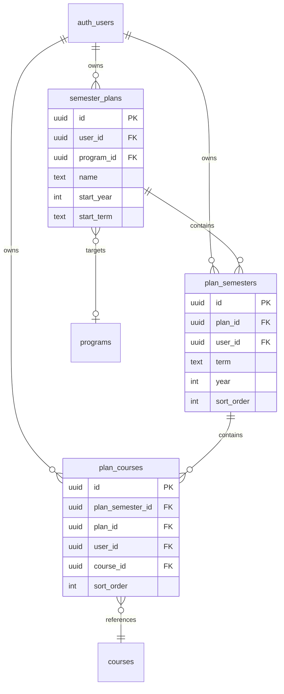

# Sprint 3: Authentication and Planner Core

## Review Feedback Applied

- **Dropped zustand** — use a custom `useGuestPlan` hook wrapping `useState` + `localStorage` (two functions: `loadGuestPlan`, `saveGuestPlan`). No state management library needed for a single data structure.
- **Collapsed guest migration** — no separate API route or dialog component. Plans page checks localStorage after login, calls existing server action `migrateGuestPlan(data)`. On success clear localStorage, on failure leave it. No confirmation dialog for MVP.
- **Dropped `plan_id` from `plan_courses`** — `user_id` is already denormalized for RLS. `plan_id` is redundant.
- **Dropped 3 premature indexes** — keep only `user_id` indexes for RLS. Add join indexes when performance data justifies them.
- **Dropped `sort_order` columns** — drag-and-drop is Sprint 4. Order semesters by `(year, term)`, courses by `created_at`. Add `sort_order` in Sprint 4 migration.
- **Dropped `start_year`/`start_term` from `semester_plans`** — derivable from `MIN(year, term)` of child semesters.
- **Dropped plan list page** — `/plans` redirects to user's single plan, auto-creating on first visit. Multi-plan list deferred.
- **Deferred Google OAuth** — email/password only in Sprint 3. Google OAuth is a one-line code change added in Sprint 4.
- **Slimmed guest course type** — store only `courseId` in localStorage, fetch display data on page load with `WHERE id IN (...)`.
- **~250 LOC reduction, 3 files eliminated, 1 dependency dropped**

## Overview

Users can sign up, log in, and build a semester-by-semester degree plan by adding/removing courses. Guest users get full planner functionality via localStorage. When a guest creates an account, their local plan migrates seamlessly to the database. At the end of this sprint, an authenticated user can create a plan, add semesters, add/remove courses from semesters, and see their plan persisted across sessions.

## Review Feedback Applied

- **Denormalized `user_id` onto `plan_semesters` and `plan_courses`** — Eliminates JOINs in RLS policies for better query performance (Kieran review)
- **Deferred drag-and-drop** — Sprint 3 uses simple add/remove buttons; `@dnd-kit` deferred to Sprint 4
- **`getUser()` over `getSession()`** — Always verify auth server-side via `getUser()`, never trust the session JWT alone
- **Guest-first design** — Planner works without an account; auth is additive, not gating

---

## Technical Approach

### Phase 1: Supabase Auth Setup

#### 1.1 Dependencies

Install at the `apps/web` level:

```json
{
  "dependencies": {
    "@supabase/ssr": "^0.6",
    "@supabase/supabase-js": "^2",
    "zustand": "^5"
  }
}
```

`@supabase/ssr` provides `createServerClient` and `createBrowserClient` for Next.js App Router. `zustand` handles client-side state with `persist` middleware for guest localStorage.

No new dependencies at the `packages/` level for this sprint.

#### 1.2 Environment Variables

```bash
# apps/web/.env.local (not committed)
NEXT_PUBLIC_SUPABASE_URL=https://<project>.supabase.co
NEXT_PUBLIC_SUPABASE_ANON_KEY=<anon-key>
```

Only the anon key is exposed to the browser. The service role key is never used in the web app.

#### 1.3 Supabase Client Utilities

Two client factories, one for server components/actions and one for the browser:

```typescript
// apps/web/src/lib/supabase/server.ts
import { createServerClient } from "@supabase/ssr";
import { cookies } from "next/headers";

export async function createClient() {
  const cookieStore = await cookies();
  return createServerClient(
    process.env.NEXT_PUBLIC_SUPABASE_URL!,
    process.env.NEXT_PUBLIC_SUPABASE_ANON_KEY!,
    {
      cookies: {
        getAll() {
          return cookieStore.getAll();
        },
        setAll(cookiesToSet) {
          cookiesToSet.forEach(({ name, value, options }) => {
            cookieStore.set(name, value, options);
          });
        },
      },
    },
  );
}
```

```typescript
// apps/web/src/lib/supabase/client.ts
import { createBrowserClient } from "@supabase/ssr";

export function createClient() {
  return createBrowserClient(
    process.env.NEXT_PUBLIC_SUPABASE_URL!,
    process.env.NEXT_PUBLIC_SUPABASE_ANON_KEY!,
  );
}
```

**Key rule:** Server components and route handlers use `server.ts`. Client components use `client.ts`. Never import the wrong one.

#### 1.4 Auth Middleware (Session Refresh)

```typescript
// apps/web/src/middleware.ts
import { createServerClient } from "@supabase/ssr";
import { NextResponse, type NextRequest } from "next/server";

export async function middleware(request: NextRequest) {
  let response = NextResponse.next({ request });

  const supabase = createServerClient(
    process.env.NEXT_PUBLIC_SUPABASE_URL!,
    process.env.NEXT_PUBLIC_SUPABASE_ANON_KEY!,
    {
      cookies: {
        getAll() {
          return request.cookies.getAll();
        },
        setAll(cookiesToSet) {
          cookiesToSet.forEach(({ name, value, options }) => {
            request.cookies.set(name, value);
            response.cookies.set(name, value, options);
          });
        },
      },
    },
  );

  // Refresh session — must use getUser() not getSession()
  const {
    data: { user },
  } = await supabase.auth.getUser();

  // Protected routes: redirect unauthenticated users to login
  const protectedPaths = ["/progress"];
  const isProtected = protectedPaths.some((p) => request.nextUrl.pathname.startsWith(p));

  if (isProtected && !user) {
    const loginUrl = new URL("/login", request.url);
    loginUrl.searchParams.set("redirect", request.nextUrl.pathname);
    return NextResponse.redirect(loginUrl);
  }

  return response;
}

export const config = {
  matcher: ["/((?!_next/static|_next/image|favicon.ico|.*\\.(?:svg|png|jpg|jpeg|gif|webp)$).*)"],
};
```

**Note:** `/plans/*` is NOT in the protected paths list. The planner works for guests via localStorage. Only `/progress/*` (future sprint) requires authentication.

**Files:**

- New: `apps/web/src/middleware.ts`
- New: `apps/web/src/lib/supabase/server.ts`
- New: `apps/web/src/lib/supabase/client.ts`

---

### Phase 2: Auth UI

#### 2.1 Login Page

```typescript
// apps/web/src/app/login/page.tsx
// Server component that renders the LoginForm client component
// - Checks if user is already logged in via getUser(); if so, redirect to /plans
// - Reads ?redirect= search param and passes to LoginForm
```

```typescript
// apps/web/src/app/login/login-form.tsx
"use client";
// - Email/password form with client-side validation
// - "Sign in with Google" button (supabase.auth.signInWithOAuth)
// - "Don't have an account? Sign up" link
// - On success: redirect to ?redirect param or /plans
// - On error: display inline error message
// - Uses createClient() from lib/supabase/client
```

#### 2.2 Signup Page

```typescript
// apps/web/src/app/signup/page.tsx
// Server component, same redirect-if-authenticated pattern as login
```

```typescript
// apps/web/src/app/signup/signup-form.tsx
"use client";
// - Email/password form (email, password, confirm password)
// - "Sign up with Google" button
// - "Already have an account? Log in" link
// - On success: show "Check your email for confirmation" message
// - On error: display inline error message
// - After signup detects localStorage guest data, triggers migration (Phase 5)
```

#### 2.3 Auth Callback Route

```typescript
// apps/web/src/app/auth/callback/route.ts
// GET handler for OAuth and email confirmation redirects
// - Exchanges code for session via supabase.auth.exchangeCodeForSession()
// - Redirects to /plans (or stored redirect path)
```

#### 2.4 Account Menu

```typescript
// apps/web/src/components/account-menu.tsx
"use client";
// - If authenticated: show user email + "Sign Out" button
// - If guest: show "Sign In" link
// - Sign out calls supabase.auth.signOut() then router.refresh()
// - Placed in the app layout header
```

#### 2.5 Layout Integration

Update `apps/web/src/app/layout.tsx`:

- Add a simple header with app name and `<AccountMenu />`
- Pass initial auth state from server to avoid flash of wrong state

**Files:**

- New: `apps/web/src/app/login/page.tsx`, `apps/web/src/app/login/login-form.tsx`
- New: `apps/web/src/app/signup/page.tsx`, `apps/web/src/app/signup/signup-form.tsx`
- New: `apps/web/src/app/auth/callback/route.ts`
- New: `apps/web/src/components/account-menu.tsx`
- Edit: `apps/web/src/app/layout.tsx`

---

### Phase 3: Database Migration (Plan Tables)

#### 3.1 Migration File

```sql
-- supabase/migrations/20260401000003_plan_tables.sql

-- 1. Semester plans (owned by a user)
create table public.semester_plans (
  id uuid primary key default gen_random_uuid(),
  user_id uuid not null references auth.users(id) on delete cascade,
  program_id uuid references public.programs(id) on delete set null,
  name text not null default 'My Plan',
  start_year integer not null,
  start_term text not null default 'Fall',
  created_at timestamptz not null default now(),
  updated_at timestamptz not null default now()
);

-- 2. Plan semesters (one row per semester slot in a plan)
create table public.plan_semesters (
  id uuid primary key default gen_random_uuid(),
  plan_id uuid not null references public.semester_plans(id) on delete cascade,
  user_id uuid not null references auth.users(id) on delete cascade,
  term text not null,           -- 'Fall', 'Spring', 'Summer'
  year integer not null,
  sort_order integer not null default 0,
  unique(plan_id, term, year)
);

-- 3. Plan courses (a course placed in a semester)
create table public.plan_courses (
  id uuid primary key default gen_random_uuid(),
  plan_semester_id uuid not null references public.plan_semesters(id) on delete cascade,
  plan_id uuid not null references public.semester_plans(id) on delete cascade,
  user_id uuid not null references auth.users(id) on delete cascade,
  course_id uuid not null references public.courses(id) on delete cascade,
  sort_order integer not null default 0,
  unique(plan_semester_id, course_id)
);

-- Enable RLS
alter table public.semester_plans enable row level security;
alter table public.plan_semesters enable row level security;
alter table public.plan_courses enable row level security;

-- RLS policies: users can only CRUD their own data
-- semester_plans
create policy "users select own plans"
  on public.semester_plans for select
  to authenticated using (user_id = auth.uid());

create policy "users insert own plans"
  on public.semester_plans for insert
  to authenticated with check (user_id = auth.uid());

create policy "users update own plans"
  on public.semester_plans for update
  to authenticated using (user_id = auth.uid());

create policy "users delete own plans"
  on public.semester_plans for delete
  to authenticated using (user_id = auth.uid());

-- plan_semesters (denormalized user_id — no join needed)
create policy "users select own semesters"
  on public.plan_semesters for select
  to authenticated using (user_id = auth.uid());

create policy "users insert own semesters"
  on public.plan_semesters for insert
  to authenticated with check (user_id = auth.uid());

create policy "users update own semesters"
  on public.plan_semesters for update
  to authenticated using (user_id = auth.uid());

create policy "users delete own semesters"
  on public.plan_semesters for delete
  to authenticated using (user_id = auth.uid());

-- plan_courses (denormalized user_id — no join needed)
create policy "users select own courses"
  on public.plan_courses for select
  to authenticated using (user_id = auth.uid());

create policy "users insert own courses"
  on public.plan_courses for insert
  to authenticated with check (user_id = auth.uid());

create policy "users update own courses"
  on public.plan_courses for update
  to authenticated using (user_id = auth.uid());

create policy "users delete own courses"
  on public.plan_courses for delete
  to authenticated using (user_id = auth.uid());

-- Indexes
create index idx_plans_user on semester_plans(user_id);
create index idx_plan_semesters_plan on plan_semesters(plan_id);
create index idx_plan_semesters_user on plan_semesters(user_id);
create index idx_plan_courses_semester on plan_courses(plan_semester_id);
create index idx_plan_courses_user on plan_courses(user_id);
create index idx_plan_courses_plan on plan_courses(plan_id);

-- updated_at trigger for semester_plans
create or replace function public.set_updated_at()
returns trigger as $$
begin
  new.updated_at = now();
  return new;
end;
$$ language plpgsql;

create trigger semester_plans_updated_at
  before update on public.semester_plans
  for each row execute function public.set_updated_at();
```

#### 3.2 RLS Design Rationale

Every RLS policy uses a simple `user_id = auth.uid()` check with no JOINs. This is why `user_id` is denormalized onto `plan_semesters` and `plan_courses` even though it could be derived by joining through `semester_plans`. Per Kieran's review: Postgres evaluates RLS policies on every row access, so JOIN-based policies degrade query performance significantly as tables grow.

The tradeoff is write-time redundancy (must set `user_id` on child rows), which is trivial in application code and enforced by NOT NULL constraints.

**Files:**

- New: `supabase/migrations/20260401000003_plan_tables.sql`

---

### Phase 4: Planner Page

#### 4.1 Route Structure

```
apps/web/src/app/plans/
  page.tsx              — Plan list (redirect to create if none)
  [id]/
    page.tsx            — Server component: fetch plan + semesters + courses
    planner-grid.tsx    — Client component: visual semester grid
    semester-card.tsx   — Client component: one semester column
    add-course.tsx      — Client component: course search + add button
```

#### 4.2 Plan List Page

```typescript
// apps/web/src/app/plans/page.tsx
// Server component:
// - If authenticated: fetch user's plans from Supabase
// - If guest: read from zustand store (client component fallback)
// - If no plans exist: redirect to create flow or show empty state with "Create Plan" button
// - If plans exist: list them with links to /plans/[id]
```

For guests, the plan list page renders a client component that reads from the zustand store. The "id" for guest plans is a locally generated UUID stored in localStorage.

#### 4.3 Planner Grid (Core UI)

```typescript
// apps/web/src/app/plans/[id]/planner-grid.tsx
"use client";
// Props: { plan, semesters, isGuest }
// - Renders a grid of semester cards (columns or rows depending on viewport)
// - "Add Semester" button at the end
// - Each semester card shows: term + year header, list of courses, "Add Course" button
// - Courses show: code, title, credits, remove button (X)
// - Total credits per semester displayed at bottom of each card
// - Grand total credits displayed somewhere visible
//
// For guests: all mutations go through the zustand store
// For authenticated users: mutations call server actions, then update local state
```

#### 4.4 Server Actions (Authenticated Users)

```typescript
// apps/web/src/app/plans/actions.ts
"use server";

// createPlan(name, startYear, startTerm, programId?)
//   - Verify auth via getUser()
//   - Insert into semester_plans
//   - Return plan id

// addSemester(planId, term, year)
//   - Verify auth + ownership
//   - Insert into plan_semesters with user_id
//   - Return semester id

// removeSemester(semesterId)
//   - Verify auth + ownership
//   - Delete from plan_semesters (cascades to plan_courses)

// addCourse(planSemesterId, planId, courseId)
//   - Verify auth + ownership
//   - Insert into plan_courses with user_id
//   - Return plan_course id

// removeCourse(planCourseId)
//   - Verify auth + ownership
//   - Delete from plan_courses

// All actions: revalidatePath("/plans/[id]")
```

Every server action begins with:

```typescript
const supabase = await createClient();
const {
  data: { user },
} = await supabase.auth.getUser();
if (!user) throw new Error("Not authenticated");
```

RLS provides defense-in-depth, but the action-level check prevents confusing error messages.

#### 4.5 Course Search for Add Course

```typescript
// apps/web/src/app/plans/[id]/add-course.tsx
"use client";
// - Text input with debounced search (300ms)
// - Queries courses table via Supabase client (public read, no auth needed)
// - Searches by code or title (using the existing text search index)
// - Shows results in a dropdown list
// - Clicking a result calls addCourse action (or zustand mutation for guests)
// - Prevents adding duplicate courses to the same semester
```

**Files:**

- New: `apps/web/src/app/plans/page.tsx`
- New: `apps/web/src/app/plans/[id]/page.tsx`
- New: `apps/web/src/app/plans/[id]/planner-grid.tsx`
- New: `apps/web/src/app/plans/[id]/semester-card.tsx`
- New: `apps/web/src/app/plans/[id]/add-course.tsx`
- New: `apps/web/src/app/plans/actions.ts`

---

### Phase 5: Guest localStorage Persistence

#### 5.1 Zustand Store

```typescript
// apps/web/src/stores/planner-store.ts
import { create } from "zustand";
import { persist } from "zustand/middleware";

interface GuestCourse {
  id: string; // locally generated UUID
  courseId: string; // references courses.id in Supabase (for display data)
  subjectCode: string; // denormalized for offline display
  number: string;
  title: string;
  credits: number;
  sortOrder: number;
}

interface GuestSemester {
  id: string; // locally generated UUID
  term: string;
  year: number;
  sortOrder: number;
  courses: GuestCourse[];
}

interface GuestPlan {
  id: string; // locally generated UUID
  name: string;
  programId: string | null;
  startYear: number;
  startTerm: string;
  semesters: GuestSemester[];
  createdAt: string;
  updatedAt: string;
}

interface PlannerState {
  plans: GuestPlan[];
  createPlan: (name: string, startYear: number, startTerm: string) => string;
  deletePlan: (planId: string) => void;
  addSemester: (planId: string, term: string, year: number) => string;
  removeSemester: (planId: string, semesterId: string) => void;
  addCourse: (
    planId: string,
    semesterId: string,
    course: Omit<GuestCourse, "id" | "sortOrder">,
  ) => void;
  removeCourse: (planId: string, semesterId: string, courseEntryId: string) => void;
  clearAll: () => void;
}

export const usePlannerStore = create<PlannerState>()(
  persist(
    (set, get) => ({
      plans: [],
      // ... mutations that update the nested state immutably
    }),
    {
      name: "majormap_guest_v1",
    },
  ),
);
```

**Design decisions:**

- Course display data (code, title, credits) is denormalized into the guest store so the planner renders without network requests
- `courseId` links back to the Supabase `courses` table for migration
- The store key `majormap_guest_v1` is versioned so future schema changes can migrate cleanly
- `clearAll()` is called after successful account migration

#### 5.2 Guest vs. Authenticated Branching

The planner components check auth state to decide which data source to use:

```typescript
// Pattern used in planner-grid.tsx and other client components:
// 1. Receive `isGuest` prop from the server component parent
// 2. If guest: read/write via usePlannerStore()
// 3. If authenticated: read from props (server-fetched), write via server actions
```

The server component at `plans/[id]/page.tsx` determines the mode:

- If the user is authenticated and the `[id]` matches a DB plan: fetch from Supabase, render with `isGuest={false}`
- If the user is not authenticated and the `[id]` matches a localStorage plan: render a client wrapper that reads from the store with `isGuest={true}`
- If neither: 404

**Files:**

- New: `apps/web/src/stores/planner-store.ts`

---

### Phase 6: Guest-to-Account Migration

#### 6.1 Migration Flow

1. User has been using the planner as a guest (data in localStorage)
2. User signs up or logs in
3. After auth callback completes, the app detects localStorage data
4. Client POSTs to `/api/migrate-guest` with the full guest plan data
5. Server action validates the data, inserts into Supabase tables
6. On success: client clears localStorage via `clearAll()`
7. On failure: localStorage is retained, user sees an error with a "Try Again" button

#### 6.2 Migration API Route

```typescript
// apps/web/src/app/api/migrate-guest/route.ts
// POST handler:
// - Authenticate via getUser()
// - Parse and validate request body (guest plan data)
// - For each guest plan:
//   1. Insert into semester_plans (with user_id)
//   2. Insert semesters into plan_semesters (with user_id, plan_id)
//   3. Insert courses into plan_courses (with user_id, plan_id, plan_semester_id)
// - Use a Supabase transaction (or ordered inserts with FK constraints)
// - Return { success: true, planIds: [...] } or { success: false, error: "..." }
```

#### 6.3 Migration Trigger

```typescript
// apps/web/src/components/guest-migration.tsx
"use client";
// - Mounted in layout, only runs when:
//   1. User is authenticated (listens to auth state change)
//   2. localStorage has guest plan data
// - Shows a confirmation dialog: "We found a plan from your guest session. Import it to your account?"
// - "Import" button triggers the migration POST
// - "Discard" button clears localStorage
// - Loading/error states handled inline
```

**Files:**

- New: `apps/web/src/app/api/migrate-guest/route.ts`
- New: `apps/web/src/components/guest-migration.tsx`

---

### Phase 7: Supabase Auth Provider Configuration

#### 7.1 Email/Password

Configured in the Supabase dashboard (not in code):

- Enable email provider
- Set confirmation email template
- Set redirect URL to `<app-url>/auth/callback`

#### 7.2 Google OAuth

Configured in the Supabase dashboard:

- Enable Google provider
- Set Google OAuth client ID and secret (from Google Cloud Console)
- Set redirect URL in Google Cloud Console to Supabase's callback URL

No code changes needed for provider configuration. The client calls `supabase.auth.signInWithOAuth({ provider: "google" })` and Supabase handles the rest.

---

## File Summary

### New Files

| File                                                 | Purpose                                    |
| ---------------------------------------------------- | ------------------------------------------ |
| `apps/web/src/middleware.ts`                         | Session refresh + protected route redirect |
| `apps/web/src/lib/supabase/server.ts`                | Server-side Supabase client factory        |
| `apps/web/src/lib/supabase/client.ts`                | Browser-side Supabase client factory       |
| `apps/web/src/app/login/page.tsx`                    | Login page (server component)              |
| `apps/web/src/app/login/login-form.tsx`              | Login form (client component)              |
| `apps/web/src/app/signup/page.tsx`                   | Signup page (server component)             |
| `apps/web/src/app/signup/signup-form.tsx`            | Signup form (client component)             |
| `apps/web/src/app/auth/callback/route.ts`            | OAuth/email callback handler               |
| `apps/web/src/app/plans/page.tsx`                    | Plan list page                             |
| `apps/web/src/app/plans/[id]/page.tsx`               | Plan detail server component               |
| `apps/web/src/app/plans/[id]/planner-grid.tsx`       | Semester grid client component             |
| `apps/web/src/app/plans/[id]/semester-card.tsx`      | Semester card client component             |
| `apps/web/src/app/plans/[id]/add-course.tsx`         | Course search + add component              |
| `apps/web/src/app/plans/actions.ts`                  | Server actions for plan CRUD               |
| `apps/web/src/stores/planner-store.ts`               | Zustand store with localStorage persist    |
| `apps/web/src/components/account-menu.tsx`           | Auth status + sign out button              |
| `apps/web/src/components/guest-migration.tsx`        | Guest-to-account migration dialog          |
| `apps/web/src/app/api/migrate-guest/route.ts`        | Migration API endpoint                     |
| `supabase/migrations/20260401000003_plan_tables.sql` | Plan tables + RLS policies                 |

### Edited Files

| File                          | Change                                                    |
| ----------------------------- | --------------------------------------------------------- |
| `apps/web/src/app/layout.tsx` | Add header with AccountMenu, wrap with migration detector |
| `apps/web/package.json`       | Add `@supabase/ssr`, `@supabase/supabase-js`, `zustand`   |

---

## Acceptance Criteria

### Functional

- [ ] User can sign up with email/password and receive a confirmation email
- [ ] User can log in with email/password
- [ ] User can sign in with Google OAuth
- [ ] User can sign out
- [ ] Authenticated user can create a new plan
- [ ] Authenticated user can add/remove semesters to a plan
- [ ] Authenticated user can search for courses and add them to a semester
- [ ] Authenticated user can remove a course from a semester
- [ ] Plan data persists across sessions for authenticated users
- [ ] Guest user can perform all planner operations without an account
- [ ] Guest plan data persists in localStorage across page refreshes
- [ ] On signup/login, guest is prompted to migrate localStorage data
- [ ] Successful migration clears localStorage and plan appears in DB
- [ ] Failed migration retains localStorage data and shows error
- [ ] Unauthenticated access to `/progress/*` redirects to `/login`
- [ ] Unauthenticated access to `/plans/*` works (guest mode)
- [ ] Each user can only see/edit their own plans (RLS enforced)

### Non-Functional

- [ ] No JOINs in any RLS policy (all use denormalized `user_id`)
- [ ] Auth check uses `getUser()` everywhere, never `getSession()` alone
- [ ] No secrets in client-side code (only `NEXT_PUBLIC_` env vars)
- [ ] Middleware runs on all pages (session refresh) without blocking static assets

### Quality Gates

- [ ] RLS policies tested: user A cannot read/write user B's plans
- [ ] Guest planner tested: create plan, add semesters, add/remove courses, refresh page, data persists
- [ ] Migration tested: guest creates plan, signs up, plan appears in DB, localStorage cleared
- [ ] Migration failure tested: simulate API error, localStorage retained
- [ ] Auth flow tested: signup, confirm email, login, logout, login again
- [ ] Protected route tested: unauthenticated user redirected from `/progress`
- [ ] Duplicate course prevention tested: same course cannot be added twice to same semester

---

## ERD (Sprint 3 -- plan tables)



---

## Out of Scope (Deferred)

- **Drag-and-drop reordering** -- Sprint 4 (`@dnd-kit/core`, `@dnd-kit/sortable`)
- **Plan sharing/collaboration** -- not planned
- **Multiple plans per user** -- supported by schema but UI shows single plan for MVP
- **Degree progress evaluation** -- Sprint 5
- **Password reset flow** -- Sprint 4 (low priority, Supabase provides the mechanics)
- **Email templates customization** -- post-MVP
- **Rate limiting on auth endpoints** -- Supabase handles this at the platform level
