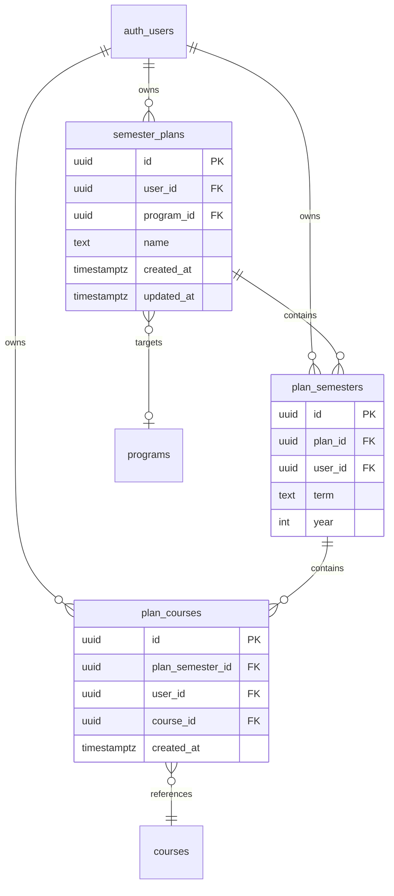

# Sprint 3 Implementation: Authentication and Planner Core

## Enhancement Summary

**Deepened on:** 2026-04-02
**Sections enhanced:** 7 phases + acceptance criteria
**Research sources:** 12 review agents, 2 skill agents, Context7 (Supabase SSR + Next.js 14), framework docs researcher, SpecFlow analyzer (28 gaps, 13 questions)

### Key Improvements from Research
1. **RLS `(select auth.uid())` pattern** — Wrapping in subquery enables Postgres initPlan caching for 100x+ performance improvement (confirmed by Supabase docs + performance oracle)
2. **Middleware cookie dance** — Context7 confirms the three-step `setAll` pattern: set on request → re-create response → set on response. Failure causes random logouts.
3. **Migration atomicity** — Manual rollback (delete plan on error) is sufficient for MVP; Supabase JS v2 doesn't support multi-statement transactions natively.
4. **Race condition guards** — AbortController for search, `useRef` migration guard to prevent double-fire, `useCallback` for stable action references.
5. **Term ordering** — Use a `TERM_ORDER` constant map (`{ Fall: 0, Spring: 1, Summer: 2 }`) for consistent sort across guest and authenticated views.
6. **Cache-Control headers** — Middleware should set `Cache-Control: private, no-store` on authenticated responses to prevent CDN caching of user-specific data.

## Overview

Users can sign up (email/password), log in, and build a semester-by-semester degree plan. Guest users get full planner functionality via localStorage. When a guest creates an account, their local plan auto-migrates to the database. At sprint end, an authenticated user has a persisted plan with RLS-enforced isolation.

**Key decisions (review overrides applied):**

- **No zustand** — custom `useGuestPlan` hook with `useState` + `localStorage`
- **No Google OAuth** — email/password only (Google deferred to Sprint 4)
- **No sort_order columns** — order semesters by `(year, term)`, courses by `created_at`
- **No start_year/start_term on semester_plans** — derive from `MIN(year, term)` of children
- **No plan_id on plan_courses** — `user_id` is denormalized for RLS, `plan_id` is redundant
- **No plan list page** — `/plans` redirects to user's single plan, auto-create on first visit
- **No confirmation dialog for migration** — auto-migrate on login, no user prompt
- **No separate API route for migration** — server action `migrateGuestPlan()`
- **No extra indexes** — only `user_id` indexes for RLS performance
- **RLS uses `(select auth.uid())`** — wrapped in subquery for Postgres initPlan caching (100x+ perf)

---

## Phase 1: Supabase Auth Infrastructure

### 1.1 Dependencies

No new dependencies needed. Already installed in `apps/web/package.json`:
- `@supabase/ssr: ^0.5`
- `@supabase/supabase-js: ^2`

### 1.2 Environment Variables

```bash
# apps/web/.env.local (not committed, already in .gitignore)
NEXT_PUBLIC_SUPABASE_URL=https://<project>.supabase.co
NEXT_PUBLIC_SUPABASE_ANON_KEY=<anon-key>
```

Only `NEXT_PUBLIC_*` vars exposed to browser. Service role key never in web app.

### 1.3 Browser Supabase Client

```typescript
// apps/web/src/lib/supabase/client.ts
import { createBrowserClient } from "@supabase/ssr";

export function createClient() {
  return createBrowserClient(
    process.env.NEXT_PUBLIC_SUPABASE_URL!,
    process.env.NEXT_PUBLIC_SUPABASE_ANON_KEY!,
  );
}
```

- `createBrowserClient` handles cookies via `document.cookie` automatically
- Safe to call multiple times (library deduplicates)
- Existing `server.ts` at `apps/web/src/lib/supabase/server.ts` is already correct

### 1.4 Middleware (Session Refresh + Route Protection)

```typescript
// apps/web/src/lib/supabase/middleware.ts — updateSession() utility
// apps/web/src/middleware.ts — entry point, calls updateSession()
```

**Critical implementation rules:**
1. Must return the `supabaseResponse` object, not a new `NextResponse.next()`
2. `setAll` must: (a) set cookies on request, (b) re-create response with `NextResponse.next({ request })`, (c) set cookies on response
3. Call `getUser()` immediately after creating the client — no code between
4. Protected paths: only `/progress` (future sprint). `/plans` is guest-accessible.
5. If `getUser()` fails (Supabase down), catch error and proceed as unauthenticated — keeps app functional
6. Matcher excludes static assets: `/((?!_next/static|_next/image|favicon.ico|.*\.(?:svg|png|jpg|jpeg|gif|webp)$).*)`

**Tests** (`apps/web/src/lib/supabase/middleware.test.ts`):
- Session refresh sets cookies on response
- Protected route `/progress` redirects unauthenticated to `/login?redirect=/progress`
- `/plans` does NOT redirect unauthenticated users
- Static assets bypass middleware
- Supabase error → proceeds as unauthenticated (no crash)

### Research Insights (Phase 1)

**From Context7 (@supabase/ssr docs):**
- `createBrowserClient` is cached as a singleton — safe to call in every component render
- Server component `setAll` must use try/catch with empty catch — middleware handles writes
- **Never put code between `createServerClient()` and `getUser()`** — the library needs to read cookies before any auth call

**From Supabase SSR docs (framework-docs-researcher):**
- `NEXT_PUBLIC_SUPABASE_PUBLISHABLE_KEY` is a new naming convention in docs — functionally identical to `ANON_KEY`. No action needed.
- `getClaims()` (v0.9+) validates JWT locally without network call — future upgrade path when moving off v0.5
- Set `Cache-Control: private, no-store` header in middleware on authenticated responses to prevent CDN caching

**Middleware implementation detail (Context7 confirmed):**
```typescript
// The critical cookie dance in setAll:
setAll(cookiesToSet) {
  cookiesToSet.forEach(({ name, value }) =>
    request.cookies.set(name, value)          // Step 1: set on request
  );
  supabaseResponse = NextResponse.next({ request }); // Step 2: re-create response
  cookiesToSet.forEach(({ name, value, options }) =>
    supabaseResponse.cookies.set(name, value, options) // Step 3: set on response
  );
}
// MUST return supabaseResponse — returning a different response loses cookies
```

**Performance (performance-oracle):**
- `getUser()` makes a network round-trip on every page load via middleware. This adds ~50-100ms latency.
- Acceptable for MVP. Future optimization: upgrade to `getClaims()` (v0.9+) for local JWT validation (~0ms).
- Matcher already excludes static assets — no unnecessary middleware invocations.

### Files

| File | Action | Purpose |
|------|--------|---------|
| `apps/web/src/lib/supabase/client.ts` | Create | Browser Supabase client |
| `apps/web/src/lib/supabase/client.test.ts` | Create | Client factory tests |
| `apps/web/src/lib/supabase/middleware.ts` | Create | `updateSession()` utility |
| `apps/web/src/lib/supabase/middleware.test.ts` | Create | Middleware logic tests |
| `apps/web/src/middleware.ts` | Create | Next.js middleware entry |

---

## Phase 2: Auth UI (Login/Signup/Callback)

### 2.1 Login Page

```
apps/web/src/app/login/
  page.tsx          — Server component: check auth (redirect if logged in), read ?redirect=
  login-form.tsx    — Client component: email/password form
  login-form.test.tsx — Form validation, submission, error display
```

- Email + password fields with client-side validation
- "Don't have an account? Sign up" link to `/signup`
- On success: redirect to `?redirect` param or `/plans`
- On error: inline error message (e.g., "Invalid email or password")
- Unconfirmed email login → "Please check your email and click the confirmation link. [Resend]"
- No Google OAuth button (deferred to Sprint 4)

### 2.2 Signup Page

```
apps/web/src/app/signup/
  page.tsx          — Server component: redirect if authenticated
  signup-form.tsx   — Client component: email/password/confirm form
  signup-form.test.tsx — Validation, submission, confirmation message
```

- Email, password, confirm password fields
- Password validation: min 8 characters (Supabase default)
- "Already have an account? Log in" link
- On success: show "Check your email for confirmation" message + "Resend" button (60s cooldown)
- No Google OAuth button

### 2.3 Auth Callback Route

```typescript
// apps/web/src/app/auth/callback/route.ts
// GET handler for email confirmation redirects
// - Exchanges code for session via supabase.auth.exchangeCodeForSession()
// - Redirects to /plans (or stored redirect path from searchParams)
```

### 2.4 Account Menu

```typescript
// apps/web/src/components/account-menu.tsx
"use client";
// - If authenticated: show user email + "Sign Out" button
// - If guest: show "Sign In" link to /login
// - Sign out: supabase.auth.signOut() → router.refresh()
```

### 2.5 Layout Integration

Edit `apps/web/src/app/layout.tsx`:
- Add `<AccountMenu />` in a header bar
- Keep it minimal — Navigation component stays per-page for now

### Files

| File | Action | Purpose |
|------|--------|---------|
| `apps/web/src/app/login/page.tsx` | Create | Login page server component |
| `apps/web/src/app/login/login-form.tsx` | Create | Login form client component |
| `apps/web/src/app/login/login-form.test.tsx` | Create | Login form tests |
| `apps/web/src/app/signup/page.tsx` | Create | Signup page server component |
| `apps/web/src/app/signup/signup-form.tsx` | Create | Signup form client component |
| `apps/web/src/app/signup/signup-form.test.tsx` | Create | Signup form tests |
| `apps/web/src/app/auth/callback/route.ts` | Create | OAuth/email callback |
| `apps/web/src/components/account-menu.tsx` | Create | Auth status + sign out |
| `apps/web/src/components/account-menu.test.tsx` | Create | Account menu tests |
| `apps/web/src/app/layout.tsx` | Edit | Add AccountMenu to header |

**UI components to copy from v0Template:**
- `v0Template/components/ui/label.tsx` → `apps/web/src/components/ui/label.tsx`
- `v0Template/components/ui/separator.tsx` → `apps/web/src/components/ui/separator.tsx`
- `v0Template/components/ui/dropdown-menu.tsx` → `apps/web/src/components/ui/dropdown-menu.tsx`

### Research Insights (Phase 2)

**From Next.js 14 docs (Context7):**
- Server Actions provide built-in CSRF protection via origin checking — no additional CSRF tokens needed for form submissions
- Auth check in server actions: return error objects `{ error: "..." }` rather than throwing — thrown errors propagate to `error.tsx` boundary, which is not user-friendly for auth failures
- `redirect()` in server actions must be called OUTSIDE try/catch blocks (it throws internally)

**From security-sentinel:**
- **Password validation:** Supabase enforces min 6 chars by default. Override to 8 chars in Supabase dashboard (Authentication → Settings → Password min length). Client-side validation should match.
- **Email confirmation:** Required by default in Supabase. Good — prevents account enumeration. Show same message for "already exists" and "confirmation sent" to avoid leaking whether an email is registered.
- **Rate limiting:** Supabase handles auth rate limiting at platform level. No custom implementation needed.

**From SpecFlow analysis:**
- **Unconfirmed email login:** Supabase returns `{ error: { message: "Email not confirmed" } }`. Map this to a user-friendly message with resend button.
- **Resend cooldown:** Use `useState` with `setTimeout` for 60s cooldown on resend button. No server-side tracking needed — Supabase rate-limits resend calls.

**Auth callback edge case:**
```typescript
// apps/web/src/app/auth/callback/route.ts
// MUST handle the case where code is missing or invalid:
export async function GET(request: NextRequest) {
  const { searchParams } = new URL(request.url);
  const code = searchParams.get("code");
  const next = searchParams.get("next") ?? "/plans";

  if (code) {
    const supabase = await createClient();
    const { error } = await supabase.auth.exchangeCodeForSession(code);
    if (!error) {
      return NextResponse.redirect(new URL(next, request.url));
    }
  }
  // On error or missing code, redirect to login with error
  return NextResponse.redirect(new URL("/login?error=auth", request.url));
}
```

---

## Phase 3: Database Migration (Plan Tables)

### 3.1 Migration SQL (Review Overrides Applied)

```sql
-- supabase/migrations/20260401000003_plan_tables.sql

-- 1. Semester plans (owned by a user)
-- NOTE: No start_year/start_term — derive from MIN(year, term) of child semesters
create table public.semester_plans (
  id uuid primary key default gen_random_uuid(),
  user_id uuid not null references auth.users(id) on delete cascade,
  program_id uuid references public.programs(id) on delete set null,
  name text not null default 'My Plan',
  created_at timestamptz not null default now(),
  updated_at timestamptz not null default now()
);

-- 2. Plan semesters (one row per semester slot)
-- NOTE: No sort_order — order by (year, term)
create table public.plan_semesters (
  id uuid primary key default gen_random_uuid(),
  plan_id uuid not null references public.semester_plans(id) on delete cascade,
  user_id uuid not null references auth.users(id) on delete cascade,
  term text not null,           -- 'Fall', 'Spring', 'Summer'
  year integer not null,
  unique(plan_id, term, year)
);

-- 3. Plan courses (a course placed in a semester)
-- NOTE: No plan_id — user_id is denormalized for RLS, plan_id is redundant
-- NOTE: No sort_order — order by created_at
create table public.plan_courses (
  id uuid primary key default gen_random_uuid(),
  plan_semester_id uuid not null references public.plan_semesters(id) on delete cascade,
  user_id uuid not null references auth.users(id) on delete cascade,
  course_id uuid not null references public.courses(id) on delete cascade,
  created_at timestamptz not null default now(),
  unique(plan_semester_id, course_id)
);

-- Enable RLS
alter table public.semester_plans enable row level security;
alter table public.plan_semesters enable row level security;
alter table public.plan_courses enable row level security;

-- RLS policies: (select auth.uid()) wrapped in subquery for initPlan caching
-- semester_plans
create policy "users select own plans"
  on public.semester_plans for select
  to authenticated using (user_id = (select auth.uid()));

create policy "users insert own plans"
  on public.semester_plans for insert
  to authenticated with check (user_id = (select auth.uid()));

create policy "users update own plans"
  on public.semester_plans for update
  to authenticated using (user_id = (select auth.uid()));

create policy "users delete own plans"
  on public.semester_plans for delete
  to authenticated using (user_id = (select auth.uid()));

-- plan_semesters (denormalized user_id — no join needed)
create policy "users select own semesters"
  on public.plan_semesters for select
  to authenticated using (user_id = (select auth.uid()));

create policy "users insert own semesters"
  on public.plan_semesters for insert
  to authenticated with check (user_id = (select auth.uid()));

create policy "users update own semesters"
  on public.plan_semesters for update
  to authenticated using (user_id = (select auth.uid()));

create policy "users delete own semesters"
  on public.plan_semesters for delete
  to authenticated using (user_id = (select auth.uid()));

-- plan_courses (denormalized user_id — no join needed)
create policy "users select own courses"
  on public.plan_courses for select
  to authenticated using (user_id = (select auth.uid()));

create policy "users insert own courses"
  on public.plan_courses for insert
  to authenticated with check (user_id = (select auth.uid()));

create policy "users update own courses"
  on public.plan_courses for update
  to authenticated using (user_id = (select auth.uid()));

create policy "users delete own courses"
  on public.plan_courses for delete
  to authenticated using (user_id = (select auth.uid()));

-- Indexes: only user_id for RLS performance (per review: drop premature join indexes)
create index idx_semester_plans_user on public.semester_plans(user_id);
create index idx_plan_semesters_user on public.plan_semesters(user_id);
create index idx_plan_courses_user on public.plan_courses(user_id);

-- Reuse existing update_updated_at() trigger from Sprint 1 catalog migration
create trigger semester_plans_updated_at
  before update on public.semester_plans
  for each row execute function update_updated_at();
```

### 3.2 RLS Design Rationale

- Every policy uses `user_id = (select auth.uid())` — the `SELECT` wrapper causes Postgres to use an initPlan, caching the result instead of calling `auth.uid()` per row (100x+ improvement on large tables)
- `user_id` is denormalized onto `plan_semesters` and `plan_courses` to avoid JOINs in RLS
- Write-time redundancy (setting `user_id` on child rows) is trivial and enforced by NOT NULL

### Research Insights (Phase 3)

**From Supabase RLS best practices (framework-docs-researcher):**
- **`(select auth.uid())` is critical** — Without the `SELECT` wrapper, Postgres calls `auth.uid()` for every row. The wrapper causes an initPlan that caches the result. Benchmarked at 100x+ improvement on tables with >10K rows.
- **`TO authenticated` role clause** is important — prevents the policy from running for `anon` role entirely, saving evaluation overhead on public pages.
- **`security definer` functions** — not needed here since all policies are simple equality checks. Only use for complex multi-table authorization logic.

**From data-integrity-guardian:**
- **Cascade chain is correct:** `auth.users` → `semester_plans` → `plan_semesters` → `plan_courses`. Deleting a user cascades cleanly through all tables.
- **`ON DELETE SET NULL` for `program_id`** is correct — if a program is removed from catalog, the plan survives (just loses its program association).
- **`ON DELETE CASCADE` for `course_id`** is acceptable but worth noting: if a course is removed during a catalog refresh, it silently disappears from user plans. Consider `ON DELETE RESTRICT` if this is unacceptable, but CASCADE is simpler for MVP.
- **Reusing `update_updated_at()`** from Sprint 1 is correct — the function already exists. Do NOT create a duplicate `set_updated_at()`.

**From architecture review:**
- **Term constraint:** Consider adding `CHECK (term IN ('Fall', 'Spring', 'Summer'))` on `plan_semesters.term` to prevent invalid values at the database level. Cheap and prevents data corruption.
- **Year constraint:** Consider `CHECK (year >= 2020 AND year <= 2040)` as a sanity bound.

**Enhanced migration SQL (add CHECK constraints):**
```sql
-- Add to plan_semesters table definition:
  term text not null check (term in ('Fall', 'Spring', 'Summer')),
  year integer not null check (year >= 2020 and year <= 2040),

-- Add to plan_courses after unique constraint:
-- Consider: ON DELETE RESTRICT instead of CASCADE for course_id
-- to prevent silent course removal from plans during catalog refresh.
-- CASCADE is simpler for MVP; revisit if catalog refreshes cause issues.
```

### Files

| File | Action | Purpose |
|------|--------|---------|
| `supabase/migrations/20260401000003_plan_tables.sql` | Create | Plan tables + RLS |

---

## Phase 4: Guest Plan Persistence (localStorage)

### 4.1 Guest Plan Hook (Replaces Zustand)

```typescript
// apps/web/src/lib/guest-plan.ts

// localStorage key: "majormap_guest_v1" (versioned for future migration)

interface GuestSemester {
  id: string;        // locally generated crypto.randomUUID()
  term: string;      // 'Fall' | 'Spring' | 'Summer'
  year: number;
  courseIds: string[]; // references courses.id in Supabase
}

interface GuestPlan {
  id: string;         // locally generated UUID
  name: string;       // default "My Plan"
  programId: string | null;
  semesters: GuestSemester[];
}

// Two core functions:
function loadGuestPlan(): GuestPlan | null
// - Reads from localStorage, returns null if empty/invalid
// - Handles JSON parse errors gracefully

function saveGuestPlan(plan: GuestPlan): void
// - JSON.stringify + localStorage.setItem

function clearGuestPlan(): void
// - localStorage.removeItem

// React hook:
function useGuestPlan(): {
  plan: GuestPlan | null;
  createPlan: (name?: string) => GuestPlan;
  addSemester: (term: string, year: number) => void;
  removeSemester: (semesterId: string) => void;
  addCourse: (semesterId: string, courseId: string) => void;
  removeCourse: (semesterId: string, courseId: string) => void;
}
// - Uses useState initialized from loadGuestPlan()
// - Every mutation calls saveGuestPlan() after state update
// - SSR-safe: returns null plan on server (no window.localStorage)
```

**Design decisions:**
- Store only `courseId` in localStorage — fetch display data (code, title, credits) on page load with `WHERE id IN (...)`
- Keeps localStorage slim (~100 bytes per course vs ~500 with full denormalization)
- Course catalog updates don't invalidate guest plans
- Versioned key `majormap_guest_v1` allows clean migration in future

### 4.2 Course Display Data Fetching

```typescript
// apps/web/src/lib/course-lookup.ts

async function fetchCoursesByIds(ids: string[]): Promise<Map<string, CourseDisplay>>
// - Queries Supabase courses table: SELECT id, code, title, credits WHERE id IN (...)
// - Returns Map for O(1) lookup
// - Public read via RLS anon policy — no auth needed
// - Used by planner grid to render course cards from guest courseIds
```

### Files

| File | Action | Purpose |
|------|--------|---------|
| `apps/web/src/lib/guest-plan.ts` | Create | Guest plan localStorage hook |
| `apps/web/src/lib/guest-plan.test.ts` | Create | Guest plan CRUD + persistence tests |
| `apps/web/src/lib/course-lookup.ts` | Create | Fetch course display data by IDs |
| `apps/web/src/lib/course-lookup.test.ts` | Create | Course lookup tests |

**Tests** (`apps/web/src/lib/guest-plan.test.ts`):
- `loadGuestPlan()` returns null when localStorage is empty
- `saveGuestPlan()` persists and `loadGuestPlan()` retrieves
- `useGuestPlan.createPlan()` creates a plan with UUID
- `useGuestPlan.addSemester()` adds a semester with term/year
- `useGuestPlan.removeSemester()` removes semester and its courses
- `useGuestPlan.addCourse()` adds courseId to semester
- `useGuestPlan.removeCourse()` removes courseId from semester
- Duplicate course prevention: addCourse with existing courseId is a no-op
- `clearGuestPlan()` removes all data
- SSR safety: returns null plan when window is undefined

### Research Insights (Phase 4)

**From TypeScript reviewer (kieran-typescript):**
- **SSR hydration mismatch** — `useState(() => loadGuestPlan())` will return `null` on server but data on client. Use a two-pass pattern:
```typescript
function useGuestPlan() {
  const [plan, setPlan] = useState<GuestPlan | null>(null);
  const [isHydrated, setIsHydrated] = useState(false);

  useEffect(() => {
    setPlan(loadGuestPlan());
    setIsHydrated(true);
  }, []);

  // Return null until hydrated to avoid mismatch
  // Components should show skeleton/loading when !isHydrated
}
```
- **Type-safe localStorage:** Wrap `JSON.parse` with Zod validation to prevent corrupted data from crashing the app:
```typescript
const GuestPlanSchema = z.object({
  id: z.string().uuid(),
  name: z.string(),
  programId: z.string().uuid().nullable(),
  semesters: z.array(GuestSemesterSchema),
});

function loadGuestPlan(): GuestPlan | null {
  const raw = localStorage.getItem("majormap_guest_v1");
  if (!raw) return null;
  const result = GuestPlanSchema.safeParse(JSON.parse(raw));
  return result.success ? result.data : null;
}
```

**From race condition reviewer (julik-frontend-races):**
- **Multiple tabs:** If a user has two tabs open, both reading/writing the same localStorage key, writes in tab A will not propagate to tab B's React state. This is acceptable for MVP — not a common usage pattern. For future: listen to `window.addEventListener('storage', ...)` to sync across tabs.
- **Rapid mutations:** `useState` + `saveGuestPlan()` is synchronous within a single tab — no race condition. Each state update triggers a save. React batches renders but not state updates, so this is safe.

**From simplicity reviewer:**
- `course-lookup.ts` could be inlined into the guest planner component instead of a separate file. However, keeping it separate is justified because it's also used by the migration flow to validate courseIds. Keep as-is.

---

## Phase 5: Planner Page

### 5.1 Route Structure

```
apps/web/src/app/plans/
  page.tsx              — Smart redirect: authenticated → their plan, guest → guest plan view
  guest-planner.tsx     — Client component: full guest planner (uses useGuestPlan)
  [id]/
    page.tsx            — Server component: fetch authenticated plan from DB
    planner-grid.tsx    — Client component: visual semester grid (shared between guest/auth)
    semester-card.tsx   — Client component: one semester with courses
    add-course.tsx      — Client component: course search + add to semester
  actions.ts            — Server actions for authenticated CRUD
```

### 5.2 Guest vs Authenticated Routing

**`/plans` page logic:**
1. Check auth via server-side `getUser()`
2. If authenticated:
   - Query `semester_plans` for user's plan
   - If plan exists: `redirect(/plans/${plan.id})`
   - If no plan: create one (server action), then redirect
3. If guest:
   - Render `<GuestPlanner />` client component
   - GuestPlanner uses `useGuestPlan()` hook
   - If no guest plan in localStorage: show inline "Create Plan" form (just a "Get Started" button that creates with defaults)
   - No `[id]` in URL for guests — always `/plans`

**`/plans/[id]` page logic:**
- Server component: fetch plan by ID + verify ownership via RLS
- If not found or not owned: redirect to `/plans`
- Render `<PlannerGrid>` with server-fetched data

### 5.3 Planner Grid (Shared UI)

```typescript
// apps/web/src/app/plans/[id]/planner-grid.tsx
"use client";

// Props: { semesters, onAddSemester, onRemoveSemester, onAddCourse, onRemoveCourse }
// - Renders semester cards in a responsive grid
// - Semesters ordered by (year, term) — Fall < Spring < Summer
// - "Add Semester" button at end (term/year picker)
// - Max 16 semesters (4 years × 4 terms)
// - Grand total credits displayed
// - Responsive: grid on desktop, stack on mobile
```

### 5.4 Semester Card

```typescript
// apps/web/src/app/plans/[id]/semester-card.tsx
"use client";

// Props: { semester, courses, onAddCourse, onRemoveCourse }
// - Header: "Fall 2026" (term + year)
// - Course list: code, title, credits, remove button (X)
// - Courses ordered by created_at (DB) or insertion order (guest)
// - Total credits at bottom
// - "Add Course" button opens search
```

### 5.5 Course Search (Add Course)

```typescript
// apps/web/src/app/plans/[id]/add-course.tsx
"use client";

// - Text input with 300ms debounced search
// - Queries Supabase courses table via browser client (public read)
// - Search by code (ilike) OR title (text search) — combined query
// - Results in dropdown list: code, title, credits
// - Click result → calls onAddCourse callback
// - Duplicate prevention: filter out courses already in this semester
// - AbortController cancels stale requests on new input
```

**Course search query:**
```sql
SELECT id, code, title, credits
FROM courses
WHERE code ILIKE '%query%' OR search_vector @@ plainto_tsquery('english', query)
LIMIT 20
```

This covers both code-based search ("CS 1410") and title-based search ("intro programming") since the existing `search_vector` covers title + description but not code.

### 5.6 Server Actions (Authenticated Users)

```typescript
// apps/web/src/app/plans/actions.ts
"use server";

// Every action starts with:
// const supabase = await createClient();
// const { data: { user } } = await supabase.auth.getUser();
// if (!user) return { error: "Not authenticated" };

export async function createPlan(name?: string)
// - Insert into semester_plans with user_id, default name "My Plan"
// - Return { planId } or { error }

export async function addSemester(planId: string, term: string, year: number)
// - Verify plan ownership via RLS (query will return nothing if not owned)
// - Insert into plan_semesters with user_id, plan_id
// - Return { semesterId } or { error }

export async function removeSemester(semesterId: string)
// - Delete from plan_semesters (cascades to plan_courses)
// - RLS enforces ownership
// - revalidatePath("/plans")

export async function addCourse(planSemesterId: string, courseId: string)
// - Insert into plan_courses with user_id, plan_semester_id, course_id
// - Duplicate prevented by unique(plan_semester_id, course_id)
// - Return { planCourseId } or { error }

export async function removeCourse(planCourseId: string)
// - Delete from plan_courses
// - RLS enforces ownership
// - revalidatePath("/plans")

export async function migrateGuestPlan(guestPlan: GuestPlan)
// - See Phase 6 below
```

### Files

| File | Action | Purpose |
|------|--------|---------|
| `apps/web/src/app/plans/page.tsx` | Create | Smart redirect / guest view |
| `apps/web/src/app/plans/guest-planner.tsx` | Create | Guest planner client component |
| `apps/web/src/app/plans/guest-planner.test.tsx` | Create | Guest planner integration tests |
| `apps/web/src/app/plans/[id]/page.tsx` | Create | Authenticated plan detail |
| `apps/web/src/app/plans/[id]/planner-grid.tsx` | Create | Semester grid UI |
| `apps/web/src/app/plans/[id]/planner-grid.test.tsx` | Create | Grid rendering tests |
| `apps/web/src/app/plans/[id]/semester-card.tsx` | Create | Semester card UI |
| `apps/web/src/app/plans/[id]/add-course.tsx` | Create | Course search + add |
| `apps/web/src/app/plans/[id]/add-course.test.tsx` | Create | Search + add tests |
| `apps/web/src/app/plans/actions.ts` | Create | Server actions for plan CRUD |
| `apps/web/src/app/plans/actions.test.ts` | Create | Server action tests |

**UI components to copy from v0Template:**
- `v0Template/components/ui/dialog.tsx` → for add-semester modal
- `v0Template/components/ui/skeleton.tsx` → loading states
- `v0Template/components/ui/command.tsx` → course search combobox (optional, could use plain input)

### Research Insights (Phase 5)

**From race condition reviewer (julik-frontend-races):**
- **Course search debounce + AbortController** — critical pattern to prevent stale results:
```typescript
const controllerRef = useRef<AbortController | null>(null);

const search = useCallback(async (query: string) => {
  controllerRef.current?.abort(); // Cancel previous request
  const controller = new AbortController();
  controllerRef.current = controller;

  const supabase = createClient();
  const { data } = await supabase
    .from("courses")
    .select("id, code, title, credits")
    .or(`code.ilike.%${query}%,title.ilike.%${query}%`)
    .limit(20)
    .abortSignal(controller.signal);
  // Only update state if this request wasn't aborted
  if (!controller.signal.aborted) setResults(data ?? []);
}, []);
```
- **Rapid add/remove clicks** — Server actions are async. If user clicks "add" twice quickly, two inserts fire. The unique constraint `(plan_semester_id, course_id)` prevents duplicates at DB level, but the second call will return an error. Handle gracefully: check for constraint violation and ignore it.

**From performance oracle:**
- **Course search uses `ilike`** which is case-insensitive but doesn't use the existing `search_vector` index for code searches. This is fine for MVP — the courses table is ~5K rows for U of U. `ilike` with `%prefix%` won't use a B-tree index but is fast enough on small tables. If it becomes slow, add a trigram GIN index: `CREATE INDEX idx_courses_code_trgm ON courses USING gin (code gin_trgm_ops)`.
- **Batch course fetch for guest display:** `WHERE id IN (...)` with up to ~100 IDs is fine. Supabase handles this efficiently. Don't paginate.

**From architecture strategist:**
- **Semester ordering constant** — Define once, use everywhere:
```typescript
// packages/shared/src/constants.ts (already has TERMS)
export const TERM_ORDER: Record<string, number> = { Fall: 0, Spring: 1, Summer: 2 };

// Sort function for semesters:
const sortSemesters = (a: Semester, b: Semester) =>
  a.year - b.year || (TERM_ORDER[a.term] ?? 3) - (TERM_ORDER[b.term] ?? 3);
```
- **Planner grid should be truly shared** — Accept callbacks (`onAddCourse`, `onRemoveCourse`, etc.) as props. The parent component (guest-planner or [id]/page) provides the implementation (localStorage mutations vs server actions). This keeps the grid pure UI.

**From pattern-recognition specialist:**
- **Server action pattern is consistent** — Every action follows: auth check → operation → revalidatePath. Good. Consider extracting the auth check into a helper:
```typescript
async function getAuthenticatedUser() {
  const supabase = await createClient();
  const { data: { user } } = await supabase.auth.getUser();
  if (!user) return { user: null, supabase, error: "Not authenticated" };
  return { user, supabase, error: null };
}
```

---

## Phase 6: Guest-to-Account Migration

### 6.1 Migration Flow (Simplified per Review)

1. Guest uses planner → data in localStorage
2. Guest signs up → receives confirmation email → clicks link → auth callback → redirected to `/plans`
3. `/plans` page loads → server component detects authenticated user → renders page
4. Client-side `useEffect` in `/plans` checks: `isAuthenticated && hasLocalStorageData`
5. Calls server action `migrateGuestPlan(guestPlanData)`
6. On success: `clearGuestPlan()` → data now in DB
7. On failure: localStorage retained, toast error "Failed to import your plan. It's still saved locally."

### 6.2 Migration Server Action

```typescript
// In apps/web/src/app/plans/actions.ts

export async function migrateGuestPlan(guestPlan: GuestPlan) {
  const supabase = await createClient();
  const { data: { user } } = await supabase.auth.getUser();
  if (!user) return { error: "Not authenticated" };

  // 1. Insert semester_plans
  const { data: plan, error: planError } = await supabase
    .from("semester_plans")
    .insert({ user_id: user.id, name: guestPlan.name })
    .select("id")
    .single();

  if (planError) return { error: planError.message };

  // 2. Insert semesters
  for (const semester of guestPlan.semesters) {
    const { data: dbSemester, error: semError } = await supabase
      .from("plan_semesters")
      .insert({
        plan_id: plan.id,
        user_id: user.id,
        term: semester.term,
        year: semester.year,
      })
      .select("id")
      .single();

    if (semError) {
      // Clean up: delete the plan (cascades to semesters)
      await supabase.from("semester_plans").delete().eq("id", plan.id);
      return { error: semError.message };
    }

    // 3. Insert courses for this semester
    if (semester.courseIds.length > 0) {
      const courseRows = semester.courseIds.map((courseId) => ({
        plan_semester_id: dbSemester.id,
        user_id: user.id,
        course_id: courseId,
      }));

      const { error: courseError } = await supabase
        .from("plan_courses")
        .insert(courseRows);

      if (courseError) {
        // Clean up: delete the plan (cascades)
        await supabase.from("semester_plans").delete().eq("id", plan.id);
        return { error: courseError.message };
      }
    }
  }

  revalidatePath("/plans");
  return { success: true, planId: plan.id };
}
```

**Edge cases handled:**
- **User already has a DB plan:** Migration creates an additional plan. `/plans` redirect uses most recently updated plan. Multi-plan list deferred but schema supports it.
- **Course deleted from catalog:** `course_id` FK will fail → migration rolls back → localStorage retained → user sees error. Acceptable for MVP.
- **Partial failure:** On any insert error, delete the plan (cascade deletes children) → clean rollback.

### 6.3 Migration Trigger (Client-Side)

```typescript
// In apps/web/src/app/plans/guest-planner.tsx or a useEffect in plans/page.tsx

// This runs in the /plans page client component:
useEffect(() => {
  if (!isAuthenticated) return;
  const guestPlan = loadGuestPlan();
  if (!guestPlan) return;

  migrateGuestPlan(guestPlan).then((result) => {
    if (result.success) {
      clearGuestPlan();
      router.push(`/plans/${result.planId}`);
    } else {
      // Show toast error, localStorage preserved
    }
  });
}, [isAuthenticated]);
```

### Files

No new files — migration logic lives in `actions.ts` and the trigger is a `useEffect` in the plans page.

**Tests** (`apps/web/src/app/plans/actions.test.ts`):
- Migration happy path: guest plan → DB plan → localStorage cleared
- Migration with empty semesters
- Migration with courses that reference valid course IDs
- Migration partial failure → rollback → no orphaned rows
- Migration when user already has a DB plan → creates additional plan
- Migration when not authenticated → error

### Research Insights (Phase 6)

**From data-migration-expert:**
- **Atomicity via manual rollback is acceptable for MVP.** Supabase JS v2 doesn't expose multi-statement transactions. The delete-on-error approach (cascade delete the plan) is clean — no orphaned rows possible because `ON DELETE CASCADE` propagates.
- **Alternative for future:** Create a Postgres RPC function that wraps all inserts in a transaction. Call via `supabase.rpc('migrate_guest_plan', { data })`. More robust but adds a migration dependency.
- **Validation before insert:** Validate all courseIds exist before starting inserts to fail fast:
```typescript
// Pre-validate courseIds
const allCourseIds = guestPlan.semesters.flatMap(s => s.courseIds);
if (allCourseIds.length > 0) {
  const { data: validCourses } = await supabase
    .from("courses")
    .select("id")
    .in("id", allCourseIds);
  const validIds = new Set(validCourses?.map(c => c.id) ?? []);
  const invalidIds = allCourseIds.filter(id => !validIds.has(id));
  if (invalidIds.length > 0) {
    return { error: `${invalidIds.length} courses no longer exist in catalog. Remove them and try again.` };
  }
}
```

**From race condition reviewer (julik-frontend-races):**
- **Migration useEffect double-fire** — In React 18 Strict Mode (dev), effects run twice. The migration effect must be idempotent or guarded:
```typescript
const migrationInProgress = useRef(false);

useEffect(() => {
  if (!isAuthenticated || migrationInProgress.current) return;
  const guestPlan = loadGuestPlan();
  if (!guestPlan) return;

  migrationInProgress.current = true;
  migrateGuestPlan(guestPlan).then((result) => {
    if (result.success) {
      clearGuestPlan();
      router.push(`/plans/${result.planId}`);
    } else {
      migrationInProgress.current = false; // Allow retry
      // Show toast error
    }
  });
}, [isAuthenticated]);
```
- **Sign-out during migration** — If user signs out while migration is in-flight, the server action will fail (auth check) but localStorage is preserved. Safe by design.

**From SpecFlow analysis:**
- **Email confirmation signup timing:** User submits signup → sees "check email" → leaves tab → clicks email link → /auth/callback → redirect to /plans. The migration check runs in `/plans` page useEffect — this is the correct place since it's the first authenticated page load after callback redirect.
- **Existing DB plan conflict:** Migration creates an additional plan. The `/plans` page redirect picks the most recently updated one (`ORDER BY updated_at DESC LIMIT 1`). This means after migration, the user sees their newly imported plan. Existing plans are preserved but not visible until multi-plan UI (deferred).

---

## Phase 7: Navigation Updates

### 7.1 Navigation Links

Edit `apps/web/src/components/landing/navigation.tsx`:
- Add "Plan" link to `navLinks` array: `{ name: "Plan", href: "/plans" }`
- Add "Sign In" / user menu in the right-side button area (or use AccountMenu)

### Files

| File | Action | Purpose |
|------|--------|---------|
| `apps/web/src/components/landing/navigation.tsx` | Edit | Add Plan link + auth UI |

---

## File Summary

### New Files (19)

| File | Purpose |
|------|---------|
| `apps/web/src/lib/supabase/client.ts` | Browser Supabase client factory |
| `apps/web/src/lib/supabase/client.test.ts` | Client factory tests |
| `apps/web/src/lib/supabase/middleware.ts` | `updateSession()` utility |
| `apps/web/src/lib/supabase/middleware.test.ts` | Middleware logic tests |
| `apps/web/src/middleware.ts` | Next.js middleware entry |
| `apps/web/src/app/login/page.tsx` | Login page |
| `apps/web/src/app/login/login-form.tsx` | Login form |
| `apps/web/src/app/login/login-form.test.tsx` | Login form tests |
| `apps/web/src/app/signup/page.tsx` | Signup page |
| `apps/web/src/app/signup/signup-form.tsx` | Signup form |
| `apps/web/src/app/signup/signup-form.test.tsx` | Signup form tests |
| `apps/web/src/app/auth/callback/route.ts` | Auth callback handler |
| `apps/web/src/components/account-menu.tsx` | Auth status component |
| `apps/web/src/components/account-menu.test.tsx` | Account menu tests |
| `apps/web/src/lib/guest-plan.ts` | Guest plan localStorage hook |
| `apps/web/src/lib/guest-plan.test.ts` | Guest plan tests |
| `apps/web/src/lib/course-lookup.ts` | Fetch course display data by IDs |
| `apps/web/src/lib/course-lookup.test.ts` | Course lookup tests |
| `apps/web/src/app/plans/page.tsx` | Plans page (smart redirect / guest) |
| `apps/web/src/app/plans/guest-planner.tsx` | Guest planner client component |
| `apps/web/src/app/plans/guest-planner.test.tsx` | Guest planner tests |
| `apps/web/src/app/plans/[id]/page.tsx` | Authenticated plan page |
| `apps/web/src/app/plans/[id]/planner-grid.tsx` | Semester grid UI |
| `apps/web/src/app/plans/[id]/planner-grid.test.tsx` | Grid tests |
| `apps/web/src/app/plans/[id]/semester-card.tsx` | Semester card |
| `apps/web/src/app/plans/[id]/add-course.tsx` | Course search + add |
| `apps/web/src/app/plans/[id]/add-course.test.tsx` | Search tests |
| `apps/web/src/app/plans/actions.ts` | Server actions (CRUD + migration) |
| `apps/web/src/app/plans/actions.test.ts` | Server action tests |
| `supabase/migrations/20260401000003_plan_tables.sql` | Plan tables + RLS |

### Edited Files (2)

| File | Change |
|------|--------|
| `apps/web/src/app/layout.tsx` | Add AccountMenu to layout header |
| `apps/web/src/components/landing/navigation.tsx` | Add Plan link + auth button |

### UI Components to Copy from v0Template (3-5)

| Source | Destination | Needed For |
|--------|-------------|------------|
| `v0Template/components/ui/label.tsx` | `apps/web/src/components/ui/label.tsx` | Form labels |
| `v0Template/components/ui/separator.tsx` | `apps/web/src/components/ui/separator.tsx` | Visual dividers |
| `v0Template/components/ui/dropdown-menu.tsx` | `apps/web/src/components/ui/dropdown-menu.tsx` | Account menu |
| `v0Template/components/ui/dialog.tsx` | `apps/web/src/components/ui/dialog.tsx` | Add semester modal |
| `v0Template/components/ui/skeleton.tsx` | `apps/web/src/components/ui/skeleton.tsx` | Loading states |

---

## Cross-Cutting Research Insights

### Security (security-sentinel)
- **Never use `getSession()` for auth verification** — only reads cached JWT, doesn't validate. Use `getUser()` everywhere (middleware, server actions, server components).
- **Service role key** must NEVER appear in `apps/web/`. Grep for `SERVICE_ROLE` before every commit.
- **Server Actions have built-in CSRF protection** via Next.js origin checking. No additional tokens needed.
- **Input validation** for server actions: validate `term` against allowed values (`Fall`, `Spring`, `Summer`), `year` against reasonable range, `courseId` as UUID format. Use Zod schemas.

### Agent-Native Architecture (agent-native-reviewer)
- **Server actions are agent-accessible** — they can be called programmatically from any client, not just browser forms. This makes the planner agent-native by default.
- **Guest planner is NOT agent-native** — it requires `localStorage` (browser-only). An agent can only use the authenticated path. This is acceptable since agents would authenticate anyway.
- **Course search is agent-native** — Supabase's public read policies allow any client (including agents) to query courses.

### Testing Strategy (from CLAUDE.md TDD requirement)
- **Mock Supabase client** in all tests — never hit real APIs
- **Use `vi.stubGlobal('localStorage', mockStorage)` for guest plan tests**
- **Server action tests** should mock `createClient()` and verify correct Supabase calls
- **Middleware tests** should use `NextRequest`/`NextResponse` mocks

---

## Implementation Order (TDD)

### Step 1: Auth Infrastructure
1. Write `client.test.ts` → implement `client.ts`
2. Write `middleware.test.ts` → implement `middleware.ts` + `middleware entry`
3. Create migration file `20260401000003_plan_tables.sql`

### Step 2: Auth UI
4. Copy needed UI components from v0Template (label, separator, dropdown-menu)
5. Write `login-form.test.tsx` → implement login page + form
6. Write `signup-form.test.tsx` → implement signup page + form
7. Implement auth callback route
8. Write `account-menu.test.tsx` → implement account menu
9. Edit layout.tsx to add account menu

### Step 3: Guest Plan
10. Write `guest-plan.test.ts` → implement `guest-plan.ts`
11. Write `course-lookup.test.ts` → implement `course-lookup.ts`

### Step 4: Planner UI
12. Write `actions.test.ts` → implement server actions
13. Write `planner-grid.test.tsx` → implement planner grid
14. Write `add-course.test.tsx` → implement course search
15. Implement semester card, plans page, guest planner, [id] page

### Step 5: Migration
16. Add migration tests to `actions.test.ts` → implement `migrateGuestPlan`
17. Add migration trigger useEffect to plans page

### Step 6: Polish
18. Edit navigation to add Plan link
19. End-to-end manual testing

---

## Acceptance Criteria

### Functional
- [ ] User can sign up with email/password and receive confirmation email
- [ ] User can log in with email/password
- [ ] User can sign out
- [ ] Authenticated user's plan auto-creates on first visit to `/plans`
- [ ] Authenticated user can add/remove semesters
- [ ] Authenticated user can search courses and add to semesters
- [ ] Authenticated user can remove courses from semesters
- [ ] Plan data persists across sessions for authenticated users
- [ ] Guest user can perform all planner operations without account
- [ ] Guest plan data persists in localStorage across page refreshes
- [ ] On login, guest plan auto-migrates to DB (no dialog)
- [ ] Successful migration clears localStorage
- [ ] Failed migration retains localStorage and shows error
- [ ] `/progress` redirects unauthenticated to `/login`
- [ ] `/plans` works for guests (no redirect)
- [ ] RLS enforced: user A cannot see user B's plans
- [ ] Duplicate course prevention per semester

### Non-Functional
- [ ] No JOINs in RLS policies (all use denormalized `user_id`)
- [ ] RLS uses `(select auth.uid())` for initPlan caching
- [ ] Auth uses `getUser()` everywhere, never `getSession()` alone
- [ ] No secrets in client code (only `NEXT_PUBLIC_*`)
- [ ] Middleware skips static assets
- [ ] No zustand dependency
- [ ] Guest localStorage key is versioned (`majormap_guest_v1`)

---

## ERD (Sprint 3 — Corrected)



---

## Out of Scope (Deferred)

- **Google OAuth** — Sprint 4 (one-line change: `signInWithOAuth({ provider: "google" })`)
- **Drag-and-drop reordering** — Sprint 4 (`@dnd-kit`, add `sort_order` columns)
- **Password reset flow** — Sprint 4
- **Multiple plans UI** — schema supports it, UI shows single plan for MVP
- **Degree progress evaluation** — Sprint 5
- **Credit overload warnings** — Sprint 5
- **Mobile-specific planner layout** — responsive grid is sufficient for MVP
