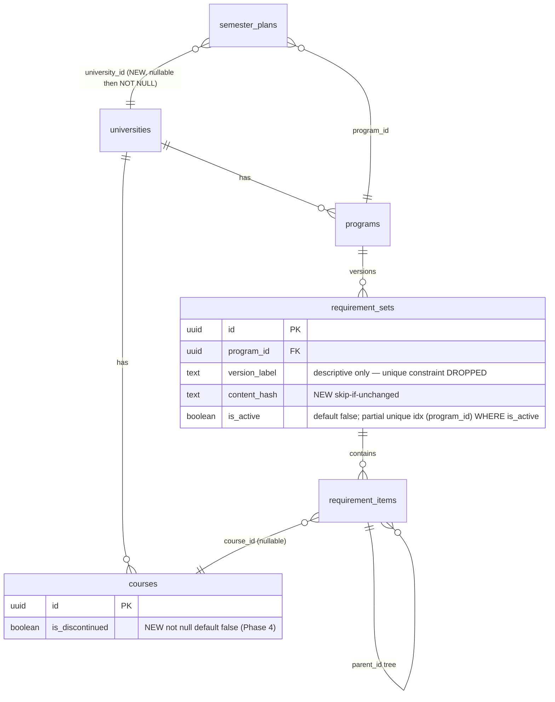

# feat: Multi-School Platform Foundation

## Enhancement Summary

**Deepened on:** 2026-06-11
**Agents used:** data-integrity-guardian, architecture-strategist, security-sentinel, performance-oracle, code-simplicity-reviewer, best-practices-researcher (Context7 + web)

### Decision changes from review (supersede the original draft)

1. **Drop `unique(program_id, version_label)`** on `requirement_sets` — insert-then-flip re-seeding the same catalog year violates it on every cron run from week 2 onward; the partial unique index now governs correctness (data-integrity P0-1).
2. **RPC hardening is mandatory**: `SECURITY INVOKER`, `set search_path = ''`, `REVOKE EXECUTE FROM public, anon, authenticated` + `GRANT to service_role`, set↔program ownership assert with `RAISE`, per-program advisory lock. Without the revoke, **any anonymous visitor can flip active requirement sets via PostgREST `/rpc/`** (security H1, data-integrity P0-3/P0-4).
3. **`plan_courses.course_id` FK → `ON DELETE RESTRICT`** (was CASCADE). Soft delete is now policy; hard deletes of courses must fail loudly, not silently destroy user plans (data-integrity P1-1).
4. **`is_active` default → `false`** + pre-index dedup of existing multi-active rows, or the partial unique index migration fails / silently activates unreviewed sets (data-integrity P0-2).
5. **Retention simplified to keep-1**: delete all inactive sets after a successful flip; delete the partially-inserted set on failure before exiting. Plus **content-hash skip**: store a hash of the normalized tree on `requirement_sets`; skip insert+flip when unchanged — avoids ~593 new sets/school/week of pure churn (simplicity + architecture).
6. **Cut `universities.coursedog_catalog_id` / `coursedog_origin` columns** — zero readers; the web never calls Coursedog and the pipeline reads `schools.json`. **catalogId is resolved at fetch time** from `/api/v1/ca/{slug}/catalogs` (pinned value in schools.json is fallback only) — a pinned id silently fetches last year's catalog forever (architecture P0-1).
7. **Phase 5 crawler cut to a runbook + `catalog:probe` CLI validator** — wildcard-DNS probing and search-result scraping is the most ToS-fragile code in the plan for value that only materializes around school #10 (simplicity; kills most of security M3's SSRF surface too).
8. **404 pages: root `not-found.tsx` only** — `notFound()` bubbles to the root boundary; per-route files would be demolished by the Phase 3 route restructure anyway (simplicity).
9. **Phase 3a split into two deploys**: 3a-i scope all queries by `university_id` (Utah default, no URL changes) ships first; 3a-ii route restructure + redirects ships second and is independently rollback-able (architecture).
10. **School switcher deferred**; `/[school]` proof via direct URLs (simplicity).

### Key additions

- Shared canonical `RequirementItem` row type in `packages/shared` (writer=catalog, reader=web, consumer=planner were about to three-way drift).
- Pagination implementation details: `count: "exact"` (correct at this scale; switch tripwire documented), clamp-via-redirect, page-1 canonical URLs, accessible `<nav>` markup, Next 14.2 `searchParams` is sync (not a Promise — that's Next 15).
- Code-search input whitelist `[A-Za-z0-9 ]` before building `.or()` strings (PostgREST filter-injection footgun); `university_id` stays a chained `.eq()`, never inside `.or()`.
- Seed performance: differentiated batch sizes (500 wide / 1000 narrow), cross-program topologically-ordered item batching, array-based flip RPC, set-based retention — ~3,000 round trips → well under 1 minute/school; drop redundant `idx_courses_lookup`.
- `[school]` segment resolves via deterministic `universityUuid(slug)` + build-time slug list — zero DB lookups; reserved-slug validation against static root segments.
- GitHub Actions specifics: `fail-fast: false`, concurrency queue (`cancel-in-progress: false`), `timeout-minutes`, environment-scoped secrets, off-peak cron minute, 60-day auto-disable mitigation, `--ignore-scripts` + SHA-pinned actions, dispatch inputs via `env:` not inline interpolation.
- Mass-discontinuation circuit breaker on the cron differ (truncated fetch must not soft-delete the whole catalog).
- `parseTranscriptAction` needs a `planId` parameter to be scopable — signature change the original draft missed.
- Existing-bug fixes pulled into scope: `upsertBatch` error swallowing must be fixed **before Phase 2** (not Phase 4); raw `error.message` leakage sweep in `plans/actions.ts`; semester-slot-squatting ownership check (security L3).

---

## Overview

Five-phase plan that takes MajorMap from a single-school (University of Utah) MVP with visibility bugs to a multi-school platform with normalized degree requirements, automated catalog refresh, and a documented school-onboarding path.

Validated premise (live API research, 2026-06-11): Coursedog's public catalog API returns degree requirements as **structured rule trees** (`completedAllOf`, `completedAtLeastXOf` + `restriction`, nested `subRules`, `and`/`or` courseGroupId lists) with a consistent schema across schools (verified at BYU and Arizona). Access requires only `Origin` + `X-Requested-With: catalog` headers — no API key. There is **no school-discovery endpoint**; each school needs `{slug, origin, catalogId}` onboarding.

## Problem Statement

The previous build _appeared_ to cover "only a few majors" — but the database holds 593 programs and 17,892 courses. The real failures:

1. **Visibility bugs**: [programs/page.tsx:31](apps/web/src/app/programs/page.tsx:31) hard-caps at `.limit(100)` (browse stops at "C"; 483 programs invisible); [courses/page.tsx:35](apps/web/src/app/courses/page.tsx:35) caps at 50 of ~17.9k. No program picker UI exists even though `semester_plans.program_id` does — the working suggestions engine is unreachable. No branded 404 pages.
2. **Requirements never parsed**: nothing populates `requirement_sets`/`requirement_items` today. Program `requisites`/`degreeMaps` are stashed whole into `programs.raw_data` JSONB ([normalizers/programs.ts:45](packages/catalog/src/normalizers/programs.ts:45)) and never normalized.
3. **Single-school hardcoding**: `UNIVERSITY_SLUG = "utah"` in [seed.ts:15](packages/catalog/src/seed.ts:15), school-specific env vars in [sources/coursedog.ts:13-21](packages/catalog/src/sources/coursedog.ts:13), hardcoded `data/raw/utah` path ([coursedog.ts:103](packages/catalog/src/sources/coursedog.ts:103)).
4. **Stale data**: fetch/seed is manual; the catalog is a one-time Spring 2025 snapshot.
5. **No path to scale**: each school must be discovered and configured by hand, with no documented process.

## Proposed Solution

Five sequential phases. Each phase is shippable on its own. **Critical sequencing constraint: all web queries must be university-scoped (3a-i) and deployed BEFORE school #2 is seeded** — otherwise browse pages interleave schools and slug collisions corrupt lookups the moment BYU data lands. Add a seed-side guard enforcing this (refuse non-`utah` slugs until the scoping migration is detected).



### Key decisions

| Question                                          | Decision                                                                                                                                                                                                                                                                                                               | Rationale                                                                                                                                             |
| ------------------------------------------------- | ---------------------------------------------------------------------------------------------------------------------------------------------------------------------------------------------------------------------------------------------------------------------------------------------------------------------- | ----------------------------------------------------------------------------------------------------------------------------------------------------- |
| Hard vs soft delete for vanished courses/programs | **Soft delete** (`is_discontinued not null default false`, both tables, Phase 4 migration) + `plan_courses.course_id` FK flipped to **RESTRICT**                                                                                                                                                                       | CASCADE silently destroys user plans; `universities→courses` cascade chain has the same hazard. RESTRICT makes hard deletes fail loudly forever       |
| Multi-school URL scheme                           | Path segment `/[school]/programs/[slug]`; redirects via `next.config` `redirects()`: **308 for detail pages**, **307 for index pages** (`/programs`, `/courses` are plausibly a future school picker — don't burn them permanently); internal links updated to new paths; `metadata.alternates.canonical` on new pages | Static segments win over dynamic; config redirects run before middleware (no Supabase session work on legacy hits); 308 is browser-cached forever     |
| `requirement_sets` activation                     | Partial unique index `(program_id) WHERE is_active` + batched RPC (see Phase 2a)                                                                                                                                                                                                                                       | supabase-js has no client transactions; `.single()` callers break on 0-or-2 active rows                                                               |
| Requirement item seeding                          | **INSERT** (never the shared `upsertBatch` — no natural key; accidental upsert duplicates trees), new-set-then-flip, **skip when content_hash unchanged**                                                                                                                                                              | Weekly no-op churn would create ~1.5M rows/year/school                                                                                                |
| `minimumGrade` rules                              | `raw_rule` JSONB only                                                                                                                                                                                                                                                                                                  | Defer column until grade-aware auditing exists                                                                                                        |
| Program picker scope                              | Authenticated plans only; `migrateGuestPlan` carries `programId` (currently dropped at [actions.ts:139-143](apps/web/src/app/plans/actions.ts:139)) with server-side validation (exists, not discontinued, school-match) — guest payload is attacker-controlled                                                        |                                                                                                                                                       |
| Plan↔school association                           | `semester_plans.university_id`, **nullable** in migration, backfilled `coalesce(program's university, utah)`; `createPlan`/`migrateGuestPlan` write it from day one; `NOT NULL` in follow-up migration; program↔plan university match enforced in `setPlanProgram`                                                     | A plan with no program belongs to no school; transcript matching needs an anchor. Write path must be specified or the column rots (simplicity review) |
| School config source                              | `packages/catalog/schools.json` (zod-validated: slug `^[a-z0-9_-]{1,64}$`, **reserved-slug list** = static root segments like `plans`, `compare`, `login`, `auth`, `health`, `signup`); seed upserts `universities` (name, coursedog_school_id, catalog_url only); seed is authoritative over those columns            | catalogId resolved live at fetch time; config columns with no readers were cut                                                                        |
| `[school]` resolution in web                      | Build-time slug list + deterministic `universityUuid(slug)` hoisted to `packages/shared` — no DB lookup, no cache invalidation                                                                                                                                                                                         | New school requires a deploy anyway (schools.json is checked in)                                                                                      |
| Requirement-item row type                         | Canonical type (incl. `"free_text"` variant + credits/courses exclusivity) in `packages/shared/src/schema.ts`; planner keeps a derived narrowed view                                                                                                                                                                   | Writer/reader/consumer were about to define it three ways                                                                                             |

## Technical Approach

### Phase 1 — Visibility fixes (P0 UX; ~days)

**Prerequisite (CI):** root `pnpm test` (vitest) added to CI — today `pnpm -r test` is `echo ok` per package, so none of the new tests would run.

**1a. Pagination on `/programs` and `/courses`**

- **Build query logic as shared functions taking `universityId` (defaulted to Utah's deterministic UUID)** so Phase 3 is a route move, not a rewrite (simplicity item 5).
- `page` searchParam: `Number.parseInt` + `Number.isSafeInteger`, `<1`/`NaN` → 1; cap the computed offset before `.range()`. Out-of-range: run the query; if `data.length === 0 && count > 0 && page > 1`, `redirect()` to the clamped page (keeps URLs honest).
- Query: `.select(cols, { count: "exact" }).order(...).order("id").range(from, from + PAGE_SIZE - 1)`. `count: "exact"` is single-digit ms at this scale; **switch tripwire** (documented, not built): total courses > ~150k rows or p95 > 100ms → `count: "estimated"` or `textSearch` on the existing `search_vector` GIN index.
- `.order("id")` tiebreaker is a correctness fix (duplicate program names repeat/skip across pages without it).
- Course code search: **whitelist input to `[A-Za-z0-9 ]` before building the `.or()` string** (PostgREST `.or()` treats `,`/`(`/`)` as syntax — injection/500 footgun); keep `university_id` as a separate chained `.eq()`, never inside `.or()`. Optional fast path: detect code-shaped queries (`/^[A-Za-z]{2,6}\s*\d/`) and route to `.eq("subject_code", subj).ilike("number", num+"%")` (uses the existing unique index; no new index needed).
- Shared `apps/web/src/components/ui/pagination.tsx`: link-based, `<nav aria-label="Pagination">` + `<ul>`, `aria-current="page"` on current, `rel="prev"/"next"`, boundaries rendered as non-link `<span aria-disabled>`; `URLSearchParams` merge preserving `q`/`type`/`dept`; omit `page=1` for canonical first-page URLs. GET-form search resets to page 1 for free (form has no `page` field).
- "Showing X–Y of Z results" near the nav.
- Note: Next 14.2 `searchParams` is a **sync prop** (Promise-typed only in Next 15) — current code already treats it as async-compatible; leave a comment for the future upgrade.

**1b. Program picker on plan page**

- New server action `setPlanProgram(planId, programId | null)` in [plans/actions.ts](apps/web/src/app/plans/actions.ts):
  - zod/UUID-validate inputs before querying (malformed UUIDs → PostgREST `22P02` leaks).
  - Ownership: `.update(...).eq("id", planId).eq("user_id", user.id).select("id").single()` and **treat zero rows as `{ error: "Plan not found" }`** — RLS alone makes cross-user updates silently "succeed" with 0 rows.
  - Reject `programId === secondary_program_id`; (Phase 3a+) verify program's `university_id` matches the plan's; (Phase 4+) reject discontinued programs.
- New client component `plans/[id]/program-picker.tsx` adapted from [compare/program-selector.tsx](apps/web/src/app/compare/program-selector.tsx) (search-based). Wire into the `<aside>` at [plans/[id]/page.tsx:226-238](apps/web/src/app/plans/[id]/page.tsx:226).
- Semantics: changing/clearing a program **never touches planned courses**; credits/suggestions recompute on render. Empty state when program set but no active requirement_set: "Requirements for this program aren't available yet" (the default state until Phase 2 ships).
- Fix `migrateGuestPlan` to carry `programId` (validated server-side).
- **While in this file** (security findings): sweep raw `error.message` returns (lines 30, 48, 63, 81, 97, 145, 157, 171) → generic messages; add parent-ownership verification to `addSemester`/`addCourse` (semester-slot squatting via unverified `planId`/`planSemesterId`, security L3).

**1c. Branded 404**

- Root `apps/web/src/app/not-found.tsx` only, styled like [error.tsx](apps/web/src/app/error.tsx), with "Browse programs" / "Browse courses" CTAs. `notFound()` from program/course detail bubbles to it. Per-route files cut (Phase 3 would orphan them).

### Phase 2 — Requirement-rule normalization (core IP; ~2 sprints)

**Prerequisite:** fix `upsertBatch` error swallowing ([seed.ts:27-33](packages/catalog/src/seed.ts:27)) **now, not in Phase 4** — a silently failed course batch leaves requirement leaves pointing at courses that never landed (`validCourseIds` is computed from the _intended_ list, not what actually inserted). Seed collects failures and exits non-zero.

**Also first:** verify migration state — `todos/003-pending-p3-migration-not-applied.md` says the base schema may be unapplied/drifted. Run `supabase migration list` against the remote; `supabase migration repair` if history is out of sync, BEFORE authoring new migrations.

**2a. Migration** `supabase/migrations/<ts>_requirement_versioning.sql` (order matters):

1. Deactivate all but the newest active set per program (dedup UPDATE keyed on `(captured_at, id)`).
2. `alter table requirement_sets alter column is_active set default false;` — with `default true`, any insert that forgets the flag either violates the index mid-seed or silently activates an unreviewed set.
3. `drop constraint requirement_sets_program_id_version_label_key;` — insert-then-flip re-seeds the same `version_label` weekly; the partial index governs correctness now.
4. `add column content_hash text;`
5. `create unique index idx_req_sets_one_active on requirement_sets(program_id) where is_active;`
6. `create index idx_req_items_parent on requirement_items(parent_id);` — the self-FK cascade does per-row child lookups; without this, large-tree deletes go quadratic.
7. Batched flip RPC:

```sql
create or replace function public.activate_requirement_sets(p_pairs jsonb)
returns void language plpgsql security invoker set search_path = ''
as $$
declare pair record;
begin
  for pair in select (e->>'program_id')::uuid as program_id, (e->>'set_id')::uuid as set_id
              from jsonb_array_elements(p_pairs) e loop
    perform pg_advisory_xact_lock(hashtextextended(pair.program_id::text, 0));
    update public.requirement_sets set is_active = false
      where program_id = pair.program_id and is_active;
    update public.requirement_sets set is_active = true
      where id = pair.set_id and program_id = pair.program_id;
    if not found then
      raise exception 'requirement_set % not found for program %', pair.set_id, pair.program_id;
    end if;
  end loop;
end; $$;

revoke execute on function public.activate_requirement_sets(jsonb) from public, anon, authenticated;
grant execute on function public.activate_requirement_sets(jsonb) to service_role;
```

- `SECURITY INVOKER` (seed runs as service_role, which bypasses RLS — DEFINER is gratuitous privilege); `search_path` pinned (Supabase linter rule 0011); the ownership `where ... and program_id = ...` + `raise` prevents cross-program flips and silent 0-row "success"; the advisory lock serializes concurrent seed runs per program (under READ COMMITTED, two concurrent flips can spuriously violate the partial index); revoke is **mandatory** — Postgres grants EXECUTE to PUBLIC by default and PostgREST exposes every public function at `/rpc/`.
- Acceptance test: anon `POST /rest/v1/rpc/activate_requirement_sets` → permission denied.

**2b. Shared type + normalizer**

- Hoist canonical `RequirementItem` row type + `type` union (`"group" | "course" | "free_text" | ...`) into `packages/shared/src/schema.ts`. Planner derives its narrowed view; web's [requirements-tree.ts](apps/web/src/lib/requirements-tree.ts) imports it.
- New `packages/catalog/src/normalizers/requirements.ts` (mirrors `walkRules` in [prerequisites.ts:41-104](packages/catalog/src/normalizers/prerequisites.ts:41)):
  - Input: program `requisites.requisitesSimple[]` + courseGroupIdMap **filtered through post-dedup `validCourseIds`** exactly like [seed.ts:119-124](packages/catalog/src/seed.ts:119) (the map is built from pre-dedup courses; unfiltered, leaves point at deduped-away IDs).
  - Output: items with client-generated UUIDs and `parent_id` links, **globally topologically ordered parents-first** (FK checks are end-of-statement within a batch; ordering matters across batches — and batches must stay sequential, never `Promise.all`).
  - Mapping: groups → `type: "group"`; `completedAllOf` → `course` leaves; `completedAtLeastXOf` → group with `courses_required = restriction` or `credits_required` (explicit mapping; never both null); `minimumGrade` → `raw_rule`.
  - Free-text fallback: unresolvable courseGroupIds, literal code strings, `courseAttributes` → `type: "free_text"` with display text + `raw_rule`. Nothing silently dropped (therefore no `rulesSkipped` stat — it would always be 0 or the invariant is broken).
  - Returns `{ items, stats: { leavesResolved, leavesFreeText } }`; also a **stable content hash** of the normalized tree.
  - Empty/missing `requisitesSimple` → no requirement_set created.

**2c. Seed integration** (performance-reviewed design):

- Per school run: normalize all programs → compare each `content_hash` against the program's current active set → **skip unchanged programs entirely**.
- For changed programs: insert new sets (`is_active: false`, `version_label` = catalog year/capture date) in batches; insert ALL changed programs' items as one globally-ordered stream in **batches of 1,000** (narrow rows; cross-program batching turns 593+ round trips into ~5-10); call `activate_requirement_sets` with all pairs (chunks of ~100).
- On any failure: delete the new set ids just created (cascade cleans partial trees), do NOT flip, exit non-zero. (Failed-run debris otherwise pollutes retention.)
- After successful flip: **delete all inactive sets** for affected programs (keep-1; nothing reads history) — one set-based statement.
- Batch sizes: 500 for wide rows w/ `raw_data` JSONB (courses), 1,000 for narrow (prereqs, items). Drop the redundant `idx_courses_lookup` (exact duplicate of the unique constraint's index — pure write amplification) in this migration.
- Target: full-school seed < 60s (was heading for 5-7 min with per-program loops).

**2d. Consumers**

- Add `free_text` rendering to the `RequirementTree` component in `programs/[slug]/page.tsx`.
- Verify suggestions end-to-end with seeded Utah data. If any program render spends > 30ms in `suggestCourses`, pre-group prereq rules into `Map<courseId, PrereqRule[]>` ([prerequisite-check.ts:14](packages/planner/src/prerequisite-check.ts:14) re-filters the full array per call — O(C×B×R)); ~15 lines, ~100x cut.
- Note for later (not blocking): plan page has a 6-stage serial query waterfall; `requirement_sets!inner(requirement_items(...))` embedding could cut it to ~3.

### Phase 3 — De-hardcode the school (~2 sprints)

**Strict order: 3a-i → 3a-ii → 3b → 3c. Seed guard: `seed()` refuses non-`utah` slugs unless the scoping migration is detected (cheap insurance against the most catastrophic mis-ordering).**

**3a-i. University-scope every query (own deploy; zero URL changes)**

- Migration: `semester_plans.university_id uuid references universities` (NO ACTION delete — consistent with RESTRICT philosophy), **nullable**, backfill `coalesce((select university_id from programs where id = program_id), (select id from universities where slug = 'utah'))` — never a hardcoded UUID literal. `plan_courses.course_id` FK → **RESTRICT** in the same migration. Follow-up migration adds `NOT NULL` after insert paths deploy.
- `createPlan` and `migrateGuestPlan` write `university_id` (Utah default until a school-choice UX exists).
- Scope by `university_id` (Utah's deterministic UUID as default): programs/courses browse + detail queries, compare selector, program picker, suggestions fetch, [sitemap.ts](apps/web/src/app/sitemap.ts).
- Transcript matching: **`parseTranscriptAction` gains a `planId` param** (it's user-scoped today — there's nothing to scope by); resolve the plan's `university_id`, scope `.in("code", codes)` by it. The bare-`code` Map at [actions.ts:224](apps/web/src/app/plans/actions.ts:224) currently keeps the _last_ school's row — cross-school corruption.
- `setPlanProgram` enforces program↔plan university match (cross-school IDOR otherwise).

**3a-ii. Route restructure (own deploy)**

- `apps/web/src/app/[school]/{programs,programs/[slug],courses,courses/[code]}/page.tsx` — thin wrappers over the shared query functions from Phase 1a.
- Slug resolution: validate against the build-time slug list from shared (`^[a-z0-9_-]{1,64}$` + known slug) → `notFound()`; id = `universityUuid(slug)`. No DB lookup. Display name from the shared slug→name map.
- Define `/[school]/page.tsx` (simple landing linking to programs/courses) and document the root-dynamic-segment/404 interplay (every unknown top-level path now hits `[school]` → unknown slug → root not-found).
- Redirects in `next.config` `redirects()`: `/programs/:slug+` and `/courses/:code+` → `/utah/...` `permanent: true` (308); bare `/programs`, `/courses` index → `permanent: false` (307). Build targets from pathname only (no host/`next` params — open-redirect hygiene). Update all internal links to the new paths (redirects are for external/legacy links). Add `metadata.alternates.canonical`.
- Do NOT add `generateStaticParams` to these pages — they're request-dynamic via Supabase cookies; static params would add a build-time DB dependency (explicit note so nobody "optimizes" later).

**3b. Pipeline config**

- `packages/catalog/schools.json` + zod schema in `packages/catalog/src/schemas/school-config.ts` (NOT shared — web never reads it): `{ slug, name, coursedogSchoolId, origin, catalogUrl, catalogId? }`; slug charset + reserved-slug validation (test asserts no overlap with static root segments).
- `fetchAll(school)`: **resolve current effective-dated catalogId from `/api/v1/ca/{slug}/catalogs` at fetch time**; `schools.json` `catalogId` is fallback/override; warn loudly when pinned ≠ current. API URL derived `https://app.coursedog.com/api/v1/cm/{coursedogSchoolId}`; headers from `origin`. Raw path `data/raw/{slug}` (slug validated at config load — it's a filesystem path component); clear error when the dir is missing.
- `seed(school)` replaces `UNIVERSITY_SLUG`; universities row upserted from config (seed is **authoritative** over name/coursedog_school_id/catalog_url — hand edits get overwritten; documented). Slug-is-forever note: renaming a slug changes every derived uuidv5 and orphans old rows — onboarding doc states it.
- School offboarding semantics: removal from schools.json is **forbidden for now** (validation comment); revisit when needed.
- CLI: `--school=<slug>` / `--all`; school-specific env vars removed from `.env.example`.

**3c. Prove with school #2**: add BYU (slug `byu`, origin `https://catalog.byu.edu`) or Arizona to schools.json; fetch + seed; verify browse/detail/picker/suggestions end-to-end; Utah behavior unchanged; record parse-coverage for school #2 — the universality proof point.

### Phase 4 — Scheduled re-fetch (cron)

- `.github/workflows/catalog-refresh.yml`:
  - `schedule: cron: "17 6 * * 1"` (off-peak odd minute — top-of-hour runs are heavily delayed) + `workflow_dispatch` with optional `school` input (**passed via `env:`, never inline `${{ inputs.school }}` in `run:` — script injection**; validated against schools.json).
  - Matrix from schools.json with **`fail-fast: false`** (per-school isolation), `timeout-minutes: 90` (default 360 would burn 6h on a hung fetch), `max-parallel: 1` (polite to Coursedog + serialized DB writes).
  - `concurrency: { group: catalog-refresh, cancel-in-progress: false }` — queue, never kill a half-finished seed.
  - Secrets: `SUPABASE_SERVICE_ROLE_KEY` as an **environment secret** (`environment: catalog-refresh`, branch-restricted to main) — the key bypasses RLS on user data too; env scoping keeps it out of every other workflow. `NEXT_PUBLIC_SUPABASE_URL` as a repo variable, not a secret.
  - Supply-chain: `permissions: contents: read`, actions pinned by SHA, `pnpm install --frozen-lockfile --ignore-scripts` in this workflow (it runs repo TS with the service key — any postinstall script would too). Never add `pull_request_target`. Keep CI secret-free (per CLAUDE.md: tests mock external services).
  - Parse-coverage stats appended to `$GITHUB_STEP_SUMMARY` in an `if: always()` step (markdown table per school).
  - **60-day auto-disable**: scheduled runs don't count as repo activity and GitHub won't email when the cron silently stops. Mitigate with keepalive-workflow action or an external heartbeat ping (heartbeat also catches failing crons).
  - Least-privilege follow-up (documented, not blocking): dedicated Postgres role with grants only on catalog tables + the RPC, connected via direct connection string — caps blast radius of both leak and logic bugs.
- Migration (Phase 4, not earlier — nothing reads them before): `courses.is_discontinued` and `programs.is_discontinued` `boolean not null default false`; partial indexes `(university_id) where not is_discontinued` once filters land.
- **Stale marking with circuit breaker**: diff DB vs fetch on **deduped natural keys** (`subject_code, number` — seed collapses Coursedog versions; raw `_id` diffing produces false discontinuations), scoped `where university_id = $1`, only after fully successful fetch+seed. **Refuse to run the differ (and fail the job) if fetched count < 90% of current non-discontinued count** — a truncated response must not soft-delete the catalog platform-wide. Un-mark courses that return.
- **Centralize the discontinued filter** in one shared query helper (or an `active_courses` view) — Phase 4 needs it on browse, search, suggestions, pickers, `addCourse`, transcript matching; one forgotten call site resurrects ghosts.
- Discontinued-in-requirements display: program detail badges discontinued course leaves ("no longer offered"); suggestions exclude them.
- `addCourse` returns a friendly message instead of raw Postgres text ([actions.ts:81](apps/web/src/app/plans/actions.ts:81) — covered by the Phase 1b sweep); `migrateGuestPlan` gets "migrate anyway, skip N missing" (today one vanished course makes a guest plan permanently unmigratable, [actions.ts:133-135](apps/web/src/app/plans/actions.ts:133)).

### Phase 5 — School onboarding (runbook + probe, crawler deferred)

- `docs/onboarding-a-school.md`: find a school's Coursedog catalog (search "Powered by Coursedog" / `*.catalog.prod.coursedog.com`), extract slug from the Nuxt payload, `GET /api/v1/ca/{slug}/catalogs`, pick current edition, add the schools.json entry.
- `catalog:probe <slug> <origin>` CLI command: fetches `/catalogs`, probes `/courses/search/$filters` (count check), validates slug/origin shape (`https:` only, slug charset), prints a ready-to-paste schools.json entry. Human review remains the gate — candidates never auto-onboard (ToS + data-quality posture).
- Probe hygiene: self-identifying `User-Agent` with contact address, existing 200ms delay + backoff, treat 403/429 as permanent stop for that host, `AbortSignal.timeout` + response size cap.
- Full crawler deferred until ~school #10 — wildcard-DNS probing + search-result scraping is the most ToS-fragile code for the least near-term value.

## System-Wide Impact

- **Interaction graph**: seed → upsert courses/programs → (hash-compare) → insert sets/items → batched RPC flip → web reads active set → suggestions consume leaves. Flip failure leaves the OLD set active and deletes the partial new set.
- **Error propagation**: seed exits non-zero on any batch failure (fixed before Phase 2); web actions return generic messages; cron summary carries per-school coverage stats; heartbeat catches silent cron death.
- **State lifecycle**: insert+flip means no partial trees are ever visible (consumers always resolve items via the active set id — keep that invariant); discontinued rows are flagged, never deleted; RESTRICT FKs make hard deletes loud; keep-1 retention bounds growth; content-hash skip eliminates no-op churn.
- **API surface parity**: program picker, compare selector, transcript matcher, suggestions, sitemap all become university-scoped together in 3a-i.
- **Integration test scenarios**: see Quality Gates.

## Acceptance Criteria

### Phase 1

- [x] Root `pnpm test` (vitest) runs in CI
- [x] All 593 programs reachable via paginated browse; `?page=N` URLs shareable/deterministic (id tiebreak); out-of-range pages redirect to clamped page; `page=-1`/`abc`/`9999` handled
- [x] Courses paginated with total count; "CS 3500" found by code; `.or()` input whitelisted; injection probe (`q=x,id.not.is.null`) returns normal results, not a filter change or 500
- [x] Pagination component: `nav[aria-label]`, `aria-current="page"`, prev/next links with `rel`, non-link disabled boundaries
- [x] Set/change/clear program from plan page; planned courses untouched; suggestions react; zero-row update treated as error (cross-user attempt gets "Plan not found")
- [x] Guest migration preserves chosen program (validated server-side); `plans/actions.ts` returns no raw Postgres messages; `addSemester`/`addCourse` verify parent ownership
- [x] Root branded 404 with CTAs
- [x] Tests written FIRST (TDD per CLAUDE.md)

### Phase 2

- [ ] Migration state reconciled (`supabase migration list` / `repair`) before new migrations _(runtime: needs DB access)_
- [x] `upsertBatch` failures collected; seed exits non-zero
- [ ] Seed populates requirement sets/items for Utah; coverage stats logged (target >80% leaves resolved; rest visible `free_text`; zero silently dropped) _(runtime: run `catalog:seed` after migrations apply)_
- [x] Exactly one active set per program (partial unique index; pre-index dedup ran; `is_active` default false; `version_label` unique constraint dropped) — migration authored; apply pending
- [ ] anon `POST /rpc/activate_requirement_sets` → permission denied _(runtime check after migration applies; revoke is in the migration)_
- [x] Fixture round-trip: nested rules + unresolvable ref + `courseAttributes` GE rule → correct tree/types/fallbacks (9 normalizer tests)
- [ ] Re-run with unchanged data: content-hash skip — zero new sets _(runtime)_
- [ ] Killed seed (post-items, pre-flip): old set still active _(runtime; failure handler implemented)_
- [x] Canonical `RequirementItem` type in `packages/shared`; `free_text` renders on program detail
- [ ] Full-school seed < 60s _(runtime)_

### Phase 3

- [x] All queries scoped (Utah default); seed guard refuses non-utah until scoping migration detected — deploy ordering documented in PR
- [x] `semester_plans.university_id` migration (backfill from program with Utah fallback); `createPlan`/`migrateGuestPlan` write it; `plan_courses.course_id` is RESTRICT — NOT NULL follow-up deferred until backfill verified in prod
- [x] `parseTranscriptAction(planId, text)` scopes matching by the plan's university
- [x] `/utah/programs/...` routes; legacy detail URLs 308, index URLs 307; internal links use new paths; canonicals set; sitemap per-school
- [ ] Two-school collision test against a live two-school DB _(runtime; unit coverage exists for scoping in every query path)_
- [x] `setPlanProgram` rejects cross-school programs (unit tested)
- [x] schools.json zod-validated incl. reserved-slug list + shared-registry sync test; catalogId resolved at fetch time with stale-pin warning
- [ ] BYU fetched, seeded, browsable, plannable _(runtime: `pnpm catalog:fetch --school=byu && pnpm catalog:seed --school=byu` after migrations + web deploy)_

### Phase 4

- [x] Weekly workflow: fail-fast off, concurrency queue, timeouts, environment-scoped secret, SHA-pinned actions, `--ignore-scripts`, dispatch input validated + via env, coverage in step summary — repo setup needed: create `catalog-refresh` environment with `SUPABASE_SERVICE_ROLE_KEY` secret + `NEXT_PUBLIC_SUPABASE_URL` variable; add keepalive/heartbeat if development goes quiet
- [x] Vanished-course handling: RESTRICT + soft delete, plan badge ("No longer offered"), centralized exclusion in browse/suggestions/addCourse, guest migration skips missing with count
- [x] Circuit breaker: truncated fetch (< 90%) throws without marking anything discontinued (unit tested)
- [ ] Version-flip-with-live-plan test against live DB _(runtime)_

### Phase 5

- [x] `docs/onboarding-a-school.md` complete; `catalog:probe` validates and prints a schools.json entry; human review gate documented

## Success Metrics

- Programs visible in browse: 100 → 593 (Utah), then 1,100+ (two schools)
- Programs with structured requirement trees: ~0 → >80% of bachelor's programs per school
- Schools supported: 1 → 2 proven; onboarding cost = schools.json entry + probe run
- Data staleness: 14-month snapshot → ≤7 days
- Full-school seed wall-clock: < 60s

## Dependencies & Risks

- **Coursedog API stability/ToS**: undocumented internal API; soft header gate is not a license. Mitigations: respectful rate limiting + UA, per-school isolation, human-reviewed onboarding, counsel review before commercializing. Loud cron + coverage stats are the drift early-warning.
- **Free-text tail**: some schools author rules as literal strings; `free_text` fallback + coverage metric makes it visible, not fatal.
- **Authority gap**: Coursedog catalog data may diverge from the school's official degree audit. Product copy: "planning aid — verify with your advisor."
- **Migration drift**: `todos/003` flags possibly-unapplied base migration — reconcile before Phase 2.
- **CI gap**: vitest not in CI — fixed in Phase 1.
- **Service-role key in CI**: full-DB credential; environment scoping now, dedicated restricted Postgres role as follow-up.

## References & Research

### Internal

- Prior UX plan: `docs/plans/2026-04-02-feat-ux-functionality-improvements-plan.md`
- Coursedog API notes: `docs/coursedog-api.md`
- Two-pass prereq normalization: `packages/catalog/src/normalizers/prerequisites.ts:41-133`
- Seed pipeline: `packages/catalog/src/seed.ts`; deterministic UUIDs: `packages/catalog/src/uuid.ts`
- Schema: `supabase/migrations/20260401000001_catalog_schema.sql` (requirement tables 93-116; redundant `idx_courses_lookup` at 144)
- Fixtures: `data/raw/fixtures/coursedog-programs-sample.json` (CPSCBS full requisites + degreeMaps)

### External (verified live 2026-06-11 + deepening research)

- Coursedog: `GET /api/v1/cm/{slug}/programs?programGroupIds=...` structured `requisites.requisitesSimple[]` (BYU, Arizona verified); `GET /api/v1/ca/{slug}/catalogs` editions; `Origin` + `X-Requested-With: catalog` gate; no discovery endpoint
- Supabase database functions security (INVOKER default, search_path linter 0011): https://supabase.com/docs/guides/database/functions
- Securing API / revoking default function privileges: https://supabase.com/docs/guides/api/securing-your-api
- PostgREST pagination & count semantics: https://docs.postgrest.org/en/v13/references/api/pagination_count.html
- Accessible pagination: https://design-system.w3.org/components/pagination.html, https://designsystem.digital.gov/components/pagination/
- GitHub Actions concurrency / step summaries / environments: https://docs.github.com/en/actions
- 60-day cron auto-disable + keepalive: https://github.com/marketplace/actions/keepalive-workflow
- Prior art (single-school scrapers): CredentialEngine/ctdl-xtra, samyok/gophergrades#95, Josh-Yamada16/byu-hackathon
